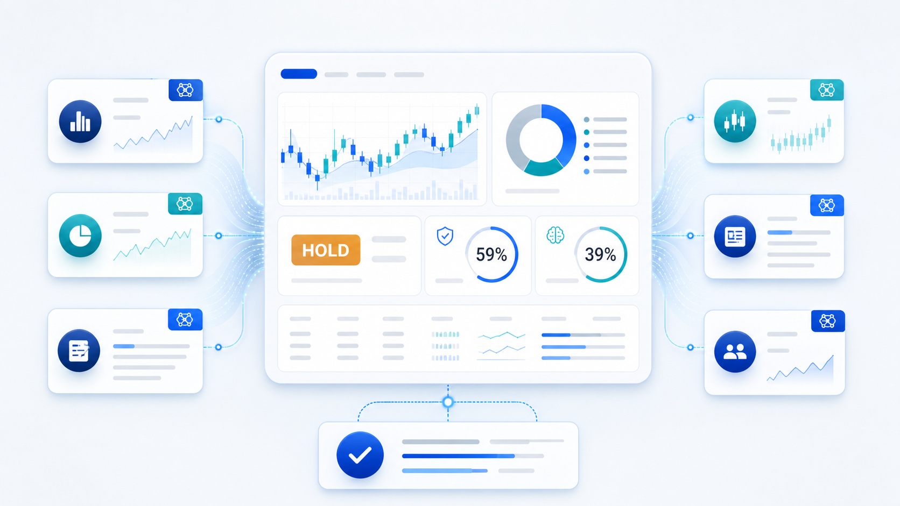
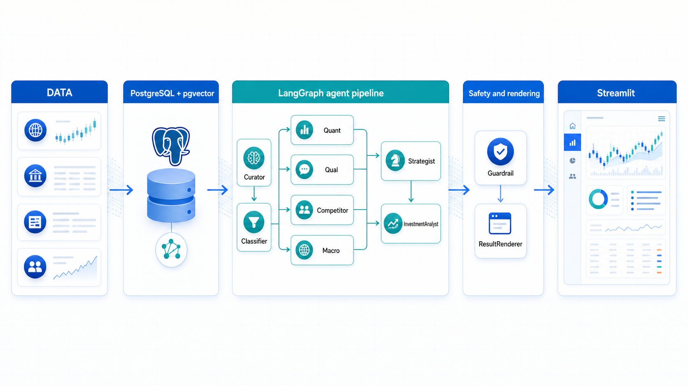

# stock-agent — BDAI 12기 팀 프로젝트

> 사용자 투자성향과 포트폴리오에 맞춰 정량·정성·Peer·거시 데이터를 종합하는 한국 주식 멀티에이전트 분석 시스템

[](https://www.python.org/)
[](https://streamlit.io/)
[](https://langchain-ai.github.io/langgraph/)
[](https://github.com/pgvector/pgvector)
[](eval/reports/2026-06-12_benchmark.md)
[](eval/reports/2026-06-20_competitor_eval.md)



## 프로젝트 소개

**What** — Streamlit에서 7단계 투자성향과 포트폴리오를 입력받아 LangGraph 전문 Agent가 분석 신호와 근거를 생성합니다.<br>
**Why** — 한 가지 지표나 모델 답변에 의존하지 않고 재무·뉴스·경쟁사·거시·개인 적합도를 함께 검토하기 위해 만들었습니다.<br>
**핵심 기능** — 병렬 Agent 분석, BUY/HOLD/SELL 성격의 Tier 1/2/3 결과, Guardrail 검증, PDF·Excel·HTML 산출물을 제공합니다.

> 출력은 투자 권유가 아닌 데이터 기반 분석 신호입니다. 최종 투자 판단과 책임은 사용자에게 있습니다.

## 기술 스택

| 영역 | 기술 | 역할 |
|------|------|------|
| 언어·모델 | Python 3.11+, Pydantic 2 | Agent 상태, 입출력 계약, 데이터 검증 |
| UI | Streamlit | 온보딩, 포트폴리오 입력, 진행 상태, Tier 결과 |
| 오케스트레이션 | LangGraph `StateGraph`, `Send` | 전문 Agent 동적 병렬 실행과 결과 병합 |
| LLM | OpenRouter Qwen, GLM, 규칙 기반 폴백 | 최종 분석 문장 보정과 장애 시 보수적 결과 |
| 데이터 | DART, pykrx, 뉴스, ECOS | 재무·공시·시세·정성·거시 근거 |
| 저장·RAG | PostgreSQL 16, pgvector | 정형 데이터와 뉴스·공시 Hybrid Search |
| 연동 | MCP | Competitor의 실시간 peer 데이터 폴백과 외부 소비 |
| 평가 | pytest, RAGAS, 규칙 기반 골든셋 | 회귀, 근거 충실도, 출력 계약 검증 |
| 인프라 | Docker, Docker Compose, GitHub Actions | 로컬 통합 실행과 PR 자동 검증 |

## 5분 실행

```bash
git clone https://github.com/Pocat-1-team/stock-agent.git
cd stock-agent
python -m venv .venv
```

```powershell
# Windows PowerShell
.venv\Scripts\Activate.ps1
pip install -r requirements-dev.txt
python -m streamlit run streamlit_app.py
```

```bash
# macOS / Linux
source .venv/bin/activate
pip install -r requirements-dev.txt
scripts/run_local_streamlit.sh
```

브라우저에서 `http://localhost:8501`을 엽니다. DB와 앱을 함께 실행하려면 `docker compose --profile app up --build`를 사용합니다. 환경변수와 DB 초기화까지 포함한 설명은 [상세 빠른 시작](#-빠른-시작)을 참고하세요.

## 시스템 아키텍처



현재 파이프라인은 `Curator -> RequestClassifier -> Quant/Qual/Competitor/Macro 병렬 실행 -> Strategist -> InvestmentAnalyst -> Guardrail -> ResultRenderer` 순서입니다. 구조의 정확한 연결과 폴백은 [Mermaid 원본](docs/architecture/readme_system_architecture.md), 더 넓은 배경은 [전체 시스템 흐름](docs/architecture/system_flow.md)에서 확인할 수 있습니다.

## 주요 결과와 성과 지표

| 지표 | 결과 | 근거 |
|------|:----:|------|
| Phase 1 규칙 기반 검증 | **40/41 (97.6%)** | [2026-06-12 평가 리포트](eval/reports/2026-06-12_benchmark.md) |
| Competitor peer 회귀 | **6/6 (100%)** | [2026-06-20 회귀 리포트](eval/reports/2026-06-20_competitor_eval.md) |
| 파이프라인 골든셋 | **5개 페르소나** | [`eval/golden_set/`](eval/golden_set/README.md) |
| 사용자 온보딩 | **7단계 질문** | `src/stock_agent/intake.py` |
| 화면 진행 추적 | **9개 Agent** | `streamlit_app.py`의 `_AGENT_PROGRESS_ORDER` |
| RAGAS faithfulness | **0.4096 / 목표 0.80** | 목표 미달 상태를 공개하고 RAG 근거 품질 개선 대상으로 관리 |

실제 실행 화면은 [온보딩 캡처](docs/assets/readme/current-streamlit-onboarding.png)와 [분석 결과 캡처](docs/assets/readme/current-streamlit-results.png)에서 확인할 수 있습니다.

---

## 📖 이 문서를 처음 읽는 분께

- **개발이 처음이신 팀원**: 아래 [용어 미니풀이](#-용어-미니풀이-처음-보는-사람용) 부터 보세요.
- **개발자 / 데이터팀**: [빠른 시작](#-빠른-시작) 으로 바로 환경 셋업.
- **PM / 기획**: [문서 영역](#-문서-영역-docs) 과 [협업 가이드](#-협업-가이드-반드시-읽어주세요) 만 봐도 됩니다.
- **상세 요구사항**: `docs/prd/PRD_v0.6.md` 부터 읽어주세요.

---

## 📚 용어 미니풀이 (처음 보는 사람용)

| 용어 | 한 줄 설명 |
|------|-----------|
| **에이전트(Agent)** | 검색·계산·분류·합성처럼 하나의 책임을 맡는 실행 단위. UI는 핵심 진행 Agent 9개를 추적 |
| **LLM** | Large Language Model. GPT·Claude·Solar 같은 대화 모델 |
| **RAG** | Retrieval-Augmented Generation. "검색해서 그 결과를 바탕으로 답변" |
| **LangGraph** | 여러 에이전트를 그래프로 연결해 동작시키는 파이썬 라이브러리 |
| **Streamlit** | 파이썬으로 웹 화면을 만드는 도구. 우리 UI |
| **Postgres** | DB. 회원·종목·재무·시세 등 정형 데이터 저장 |
| **pgvector** | Postgres 안에서 뉴스·공시 임베딩을 저장하고 유사도 검색하는 확장 |
| **DART** | 금융감독원 전자공시. 한국 상장사 재무·공시 공식 데이터 출처 |
| **pykrx** | KOSPI/KOSDAQ 시세를 무료로 가져오는 파이썬 라이브러리 |
| **LangSmith** | LLM·LangGraph 호출을 추적·디버깅하는 도구 (추후 도입) |
| **PR** | Pull Request. "내 작업을 메인 코드에 합쳐달라" 요청 |
| **PM** | Project Manager. 본 레포는 PM 2명이 PR 검수·Merge 담당 |

> 더 많은 용어는 `docs/glossary.md` 를 보세요.

---

## 🎯 시스템 한눈에

### 현재 구현 상태

| 영역 | 상태 | 비고 |
|------|------|------|
| Phase 1 E2E | 구현됨 | `StateGraph`에서 Curator·Classifier 이후 Quant/Qual/Competitor/Macro 병렬 실행, 합성·검증·렌더링 |
| UI | 구현됨 | `streamlit_app.py`에서 7단계 온보딩, Agent 진행 상태, Tier 1/2/3와 다운로드 확인 |
| 공통 개발환경 | 구현됨 | Docker Compose로 `Streamlit app + Postgres pgvector` 실행 |
| RAG 저장소 | 구현됨 | Postgres + pgvector 기반 문서·청크 저장과 Hybrid Search |
| LangSmith | 준비 중 | 환경변수 placeholder만 반영, 실제 tracing 모듈은 후속 작업 |
| CI 안전망 | 구현됨 | `.github/workflows/ci.yml` — compileall + pytest 게이트로 PR 자동 검증 |

### 주요 에이전트
1. **InvestorProfile Agent** — 온보딩 답변 → 투자성향·기간·손실감내·유동성 니즈 구조화
2. **Curator Agent** — 사용자 자연어와 포트폴리오 → 분석 대상 종목/후보 큐레이션
3. **RequestClassifier Agent** — 질문 → intent·scope·urgency 구조화
4. **Qual Worker Agent ★** — 뉴스·공시 RAG와 근거 부족 폴백으로 호재·악재 분석
5. **Quant Worker Agent** — DART 재무 + pykrx 시세 기반 정량 분석
6. **Competitor Agent** — 동종업계 Peer 추출 + 횡비교 (DB→MCP 실시간 시세→mock 3단 폴백, 품질 회귀 골든셋·MCP 외부 노출 완비)
7. **Strategist & Synthesizer Agent** — worker 결과와 포트폴리오 맥락 종합
8. **InvestmentAnalyst Agent** — GLM으로 최종 분석 신호와 포트폴리오 적합도 보정
9. **Guardrail & Evaluator Agent** — 위험 표현 차단 + 안전 문구 적용

### 11 사용자 기능

**기본 기능 (Phase 1, 7~8주차)**: 회원가입 / 보유 종목 등록 / 종목 검색 / 종목 기본 정보 / 포트폴리오 일괄 안내
**고급 기능 (Phase 2, 9~11주차)**: 5개년 밸류에이션 / 산업·정성 분석 / 동종업계 횡비교 / BUY·HOLD·SELL 분석 신호 / 종목 추천 (Curator) / PB 리포트 다운로드

자세한 내용은 `docs/prd/PRD_v0.6.md` 참조.

---

## 🗂 프로젝트 구조

> ⚠️ **Streamlit 표준 구조** — `streamlit_app.py` 와 `pages/` 는 반드시 루트에 위치 (Streamlit이 자동 인식).

```text
stock-agent/
│
├── streamlit_app.py               🖥 Streamlit Cloud 진입점 (홈 페이지)
├── pages/                         🖥 Streamlit 멀티페이지 (자동 인식) — 페이지는 7~8주차 작성 예정(현재 .gitkeep)
│   ├── 1_분석_진행중.py            (예정)
│   ├── 2_추천_결과.py              (예정)
│   ├── 3_상세_산출물.py            (예정)
│   └── 9_관리자_평가.py            (예정)
│
├── ui/                            🖥 재사용 UI 컴포넌트 (페이지에서 import)
│   └── components/                액션 카드·근거 카드·진행 사이드바·책임고지
│
├── docs/                          📘 PM 문서 영역 (요구사항·설계·운영)
│   ├── prd/                       PRD (요구사항 정의서)
│   ├── functional-spec/           기능 명세서 (각 기능 동작)
│   ├── architecture/              시스템 설계 (흐름도·ERD·에이전트)
│   │   ├── system_architecture_dashboard.html
│   │   │                            인터랙티브 시스템 아키텍처 대시보드
│   │   ├── backtesting_demo_architecture.md
│   │   │                            백테스팅 시연 검증 아키텍처 문서
│   │   └── backtesting_demo_dashboard.html
│   │                                백테스팅 시연 검증 HTML 시각화
│   ├── roadmap/                   주간 진행 로드맵 (날짜별 HTML 대시보드)
│   ├── operations/                운영 가이드 (LLM 비용·배포)
│   ├── decisions/                 ADR (의사결정 기록)
│   ├── notion/                    노션 원본/정리본 보관
│   ├── glossary.md                용어집
│   └── assets/                    이미지·다이어그램 SVG/PNG
│
├── datas/                         📥 데이터 수집 (데이터팀)
│   ├── news/                      뉴스 크롤링
│   ├── macro/                     매크로 지표
│   └── dart/                      DART 재무·공시
│
├── db/                            🗄 DB 스키마
│   └── init/                      Postgres + pgvector 초기화 SQL
│
├── src/stock_agent/               🤖 애플리케이션 코드 (Streamlit이 import)
│   ├── agents/                    분류·전문 분석·합성·검증 Agent 구현
│   ├── mcp_bridge/                Competitor peer 데이터 MCP 브리지
│   ├── graph/                     LangGraph 오케스트레이션
│   ├── prompts/                   LLM 프롬프트 (코드와 분리 보관)
│   ├── harness/                   횡단 컴포넌트 (가드레일·출처추적·용어풀이)
│   ├── llm/                       LLM 추상화 + 비용 라우팅
│   ├── rag/                       Postgres pgvector + Hybrid Search + Reranker
│   ├── schemas/                   Pydantic 모델
│   ├── tools/                     외부 데이터 Tool (DART·pykrx·News)
│   ├── config.py                  공통 설정
│   └── db.py                      DB 연결
│
├── eval/                          🧪 평가 하네스
│   ├── golden_set/                파이프라인 골든셋 (페르소나 입력·기대 결과)
│   ├── competitor_golden/         Competitor peer 비교 품질 회귀 골든셋
│   ├── reports/                   일별 자동 평가 리포트
│   ├── run_benchmark.py           파이프라인 평가 (rule-based + RAGAS)
│   └── run_competitor_eval.py     Competitor 회귀 평가 (순수 엔진, 비용 0)
│
├── scripts/                       🛠 운영 스크립트 (cron·배치 분석 등)
│   ├── apply_db_schema.py         기존 Docker 볼륨에 최신 DB 스키마 적용
│   └── check_db.py                DB 연결 + pgvector/RAG 테이블 확인
├── tests/                         ✅ 단위·통합 테스트
│
├── Dockerfile, docker-compose.yml
├── pyproject.toml                 Python 의존성
├── requirements.txt               운영/기본 설치 진입점
├── requirements-dev.txt           개발 설치 진입점
└── .env.example                   환경 변수 예시
```

> 각 폴더 안의 `README.md` 가 더 자세한 책임·작업 규칙을 담고 있습니다.

---

## 🚀 빠른 시작

### 로컬에서 단계형 투자성향/포트폴리오 분석 UI 확인

현재 브랜치에서는 Streamlit으로 다음 흐름을 바로 확인할 수 있습니다.

1. 투자성향 질문 카드에 답변
2. 반도체/금융 후보 종목의 보유 수량과 평단가 입력
3. 보유 현금 입력
4. `투자성향 확인` 클릭
5. `InvestorProfile → Curator → RequestClassifier → Quant/Qual/Competitor → Strategist → InvestmentAnalyst(GLM) → Guardrail` 실행 결과 확인
6. 아래 `대화형 질문`에서 추가 질문 실행

GLM key 없이도 local mock/rule-based fallback으로 화면 확인이 가능합니다.

```bash
python -m venv .venv
source .venv/bin/activate
pip install -r requirements-dev.txt
scripts/run_local_streamlit.sh
```

브라우저에서 `http://127.0.0.1:8501`을 엽니다.

GLM 기반 투자 분석기까지 확인하려면 key를 파일에 저장하지 말고, 실행 프로세스 환경변수로만 주입합니다.

```bash
GLM_API_KEY="glm:YOUR_LOCAL_KEY" \
scripts/run_local_streamlit.sh
```

필요하면 포트도 바꿀 수 있습니다.

```bash
PORT=8502 scripts/run_local_streamlit.sh
```

주의:
- `.env`, API key, 개인 token은 커밋하지 않습니다.
- GLM key가 없거나 호출에 실패하면 `InvestmentAnalyst Agent`는 기존 mock Strategist 결과로 fallback합니다.
- 현재 데이터/정량/정성 worker는 MVP mock 데이터이며, 실제 DART/RAG/시세 연결은 후속 단계입니다.

### Docker 권장 실행

팀원이 같은 환경에서 바로 확인하려면 Docker 실행을 우선 권장합니다.

```bash
cp .env.example .env
docker compose --profile app up --build
```

브라우저에서 `http://localhost:8501`을 엽니다.

기존에 `stock-agent_postgres_data` Docker 볼륨을 이미 만든 팀원은 컨테이너가 떠 있는 상태에서 한 번만 아래 명령을 실행합니다.

```bash
docker compose --profile app run --rm app python scripts/apply_db_schema.py
docker compose --profile app run --rm app python scripts/check_db.py
```

`check_db.py` 출력에서 `pgvector=True`, `rag_documents=True`, `rag_chunks=True`가 보이면 정상입니다.

### 1. 환경 변수 준비

```bash
cp .env.example .env
```

필요한 값(API 키 등)은 `.env`에 채워 넣습니다. **`.env`는 절대 커밋하지 마세요.**

### 2. PostgreSQL만 실행

```bash
docker compose up -d db
```

기본 접속 정보:
- Host: `localhost` / Port: `5432`
- Database: `stock_agent` / User: `stock_agent` / Password: `stock_agent`
- Docker에서는 `pgvector/pgvector:pg16` 이미지를 사용합니다.

기존 로컬 Docker 볼륨을 이미 만든 팀원은 새 스키마가 자동 적용되지 않을 수 있습니다. 이때는 DB를 띄운 뒤 아래 명령을 실행합니다.

```bash
docker compose --profile app run --rm app python scripts/apply_db_schema.py
```

### 3. Python 개발 환경

```bash
python -m venv .venv
source .venv/bin/activate          # Windows: .venv\\Scripts\\activate
pip install -r requirements-dev.txt
```

의존성의 기준 파일은 `pyproject.toml`입니다. `requirements.txt`와 `requirements-dev.txt`는 팀원이 익숙한 명령으로 설치할 수 있게 둔 얇은 진입점입니다.

### 4. DB 연결 확인

```bash
python scripts/check_db.py
```

### 5. Streamlit UI 실행

```bash
scripts/run_local_streamlit.sh
```

브라우저가 열리며 홈(`streamlit_app.py`)이 표시됩니다. `pages/` 멀티페이지(1_분석_진행중·2_추천_결과·3_상세_산출물·9_관리자_평가)는 7~8주차 작성 예정이며, 작성되면 사이드바에 자동 노출됩니다.

> Streamlit 멀티페이지는 `pages/` 가 *루트* 에 있어야 자동 인식됩니다. `ui/pages/` 같은 곳에 두면 안 됨.

### Docker로 앱까지 실행

```bash
docker compose --profile app up --build
```

브라우저에서 `http://localhost:8501`을 엽니다. 현재 Phase 1은 삼성전자 1종목 기준 mock E2E입니다.

---

## 🤝 협업 가이드 (반드시 읽어주세요)

> 개발 경험이 적어도 걱정 마세요. 이 규칙은 **여러분의 작업물이 사고로 사라지는 것을 막는 안전망** 입니다.
> 모르는 게 있으면 PM에게 질문해 주세요.

### 0. 팀 구성과 역할 (누가 무엇을 맡나)

본 레포는 PM 2명(이동원·백형준) 체제로 운영하며, 아래 역할은 실제 머지된 PR 기준으로 정리했습니다.

| 이름 | GitHub | 역할 | 주요 기여 (머지된 PR 기준) |
|------|--------|------|------|
| **이동원** | [`mygithub05253`](https://github.com/mygithub05253) | PM · 팀장 · 개발 | 문서·설계 트랙 전반, Competitor Agent(3단 폴백·복합 유사도·MCP 외부 노출), RAGAS 평가 하네스, Strategist resilience·Guardrail 실게이팅, CI 안전망 |
| **백형준** | [`vividbaek`](https://github.com/vividbaek) | PM · 개발 | UI(Agent 진행 카드·LangGraph streaming), 단계형 투자성향 intake, Curator·InvestmentAnalyst GLM 연동 |
| **윤수정** | [`Yoonssu`](https://github.com/Yoonssu) | 개발 · 데이터 관리 | Quant Agent(재무·시세 지표·부채비율), Qual Agent 공시 연결, Guardrail 개발, CI 오류 수정 |
| **문수빈** | [`melinamuun`](https://github.com/melinamuun) | 개발 · 데이터 관리 | Macro Agent(거시환경 평가·라우팅), Supabase DB 연결·macro 759건 적재, LangGraph Send API fan-out |
| **김도예** | [`doyekeem`](https://github.com/doyekeem) | 개발 · 데이터 관리 | 뉴스 크롤러, 뉴스 RAG 임베딩 파이프라인, Qual Hybrid RAG·Reranker·검색 평가 |

> 역할은 고정 분담이 아니라 주력 영역입니다. 폴더별 세부 책임은 아래 [폴더 책임 분담](#4-폴더-책임-분담-어디에-뭘-넣어야-할까)을 함께 보세요.

### 1. 브랜치 규칙 (내 작업 공간 만들기)

`main` 코드에 직접 수정하면 안 됩니다. 무조건 본인 브랜치에서 작업:

| 브랜치 | 의미 | 직접 push 가능? |
|--------|------|-----------------|
| **`main`** | 라이브 배포용 무균실 | ❌ PM Merge만 |
| **`dev`** | 팀원 코드 합쳐서 테스트하는 놀이터 | ❌ PR Merge만 |
| **개인 작업** | `<유형>/<본인ID>-<작업내용>` | ✅ 본인만 |

**브랜치명 예시**:
- `feature/p2-crawling-naver` (P2가 네이버 크롤링 기능 추가)
- `feature/p3-quant-agent` (P3가 Quant Agent 구현)
- `docs/pm-prd-v06` (PM이 PRD v0.6 작성)
- `fix/p4-langsmith-trace` (P4가 LangSmith 트레이싱 버그 수정)

### 2. 커밋 메시지 규칙 (저장할 때 남기는 메모)

머리말(prefix)을 꼭 달아주세요. 누가 봐도 "어떤 종류의 작업"인지 알 수 있게.

| Prefix | 의미 | 예시 |
|--------|------|------|
| ✨ `Feat` | 새 기능 추가 | `✨ Feat: 네이버 뉴스 크롤링 기능 추가` |
| 🐛 `Fix` | 버그 수정 | `🐛 Fix: 차트 안 보이는 오류 해결` |
| 📝 `Docs` | 문서 수정 | `📝 Docs: PRD v0.6 작성` |
| 🎨 `Style` | 코드 정렬·디자인 (기능 변화 X) | `🎨 Style: ruff 적용` |
| ♻️ `Refactor` | 동작은 같고 구조만 변경 | `♻️ Refactor: agent 파일 분리` |
| ✅ `Test` | 테스트 추가/수정 | `✅ Test: curator 단위테스트 추가` |
| 🔧 `Chore` | 빌드·설정 변경 | `🔧 Chore: pyproject.toml 의존성 추가` |

### 3. PR (Pull Request) 규칙

내 브랜치 작업이 끝나면 `dev`(또는 `main`)에 합쳐달라고 *결재* 를 올립니다. 이게 PR.

1. **절대 혼자 Merge 금지** — PM 2명 중 1명 이상의 승인 필요
2. PR 올린 후 **단톡방에 알림** ("P3 Quant Agent PR 올렸습니다!")
3. **PR 본문에 들어가야 할 것**:
   - 무엇을 했는지 (1~3줄 요약)
   - 왜 했는지 (관련 이슈·PRD 섹션)
   - 어떻게 테스트했는지 (스크린샷·테스트 결과)
4. PM 검수 후 Merge → `dev` 에 합쳐짐
5. `dev`에서 통합 테스트 후 일정 시점에 `main` 으로 일괄 Merge

> *왜 이렇게 하나요?* 오류 코드가 라이브에 바로 올라가는 것을 막고, 서로 무슨 작업하는지 알기 위해서.

### 4. 폴더 책임 분담 (어디에 뭘 넣어야 할까?)

| 폴더 | 누가 작업? | 무엇을 넣나? |
|------|-----------|-------------|
| `datas/news/` | 데이터팀 (뉴스) | 뉴스 크롤러 + 정제 코드 |
| `datas/macro/` | 데이터팀 (매크로) | ECOS·FRED 수집 |
| `datas/dart/` | 데이터팀 (DART) | DART 재무·공시 수집 |
| `db/init/` | 데이터팀 + 백엔드 | Postgres 스키마 SQL |
| `src/stock_agent/agents/` | 에이전트 담당 | 분류·전문 분석·합성·검증 Agent 구현 |
| `src/stock_agent/graph/` | 에이전트 담당 | LangGraph 오케스트레이션 |
| `src/stock_agent/prompts/` | 에이전트 + PM | LLM 프롬프트 (코드와 분리) |
| `src/stock_agent/rag/` | 에이전트 (RAG) | Postgres pgvector + Reranker |
| `src/stock_agent/tools/` | 에이전트 (Tool) | 외부 데이터 Tool 함수 |
| `ui/` | UI 담당 | Streamlit 페이지·컴포넌트 |
| `eval/` | 평가 담당 + PM | 골든셋·평가 스크립트 |
| `docs/` | **PM** | 모든 기획·설계·운영 문서 |

### 5. 에이전트 작업 분리 기준

에이전트 담당자는 먼저 `schemas/`의 입출력 계약을 맞추고, 각자 `agents/`와 `tools/`를 분리해서 작업합니다.

| 담당 | 주 작업 위치 | 책임 |
|------|--------------|------|
| Curator | `src/stock_agent/agents/curator.py` | 질문에서 의도·종목·후보 추출 |
| Quant | `src/stock_agent/agents/quant.py`, `src/stock_agent/tools/` | 재무·주가 조회와 지표 계산 |
| Qual | `src/stock_agent/agents/qual.py`, `src/stock_agent/rag/` | 뉴스·공시 RAG와 이벤트 유형 분류 |
| Competitor | `src/stock_agent/agents/competitor.py` | 같은 섹터 Peer 추출과 비교 |
| Strategist | `src/stock_agent/agents/strategist.py` | 결과 종합과 분석 신호 생성 |
| Guardrail | `src/stock_agent/agents/guardrail.py`, `src/stock_agent/harness/` | 투자권유 표현 완화와 근거 부족 경고 |
| Graph | `src/stock_agent/graph/` | LangGraph 연결과 병렬 fan-out |

원칙:
- `agents/`에는 판단 흐름을 둡니다.
- DB 조회, API 호출, 계산식은 `tools/` 또는 `rag/`로 분리합니다.
- 프롬프트는 `.py`에 직접 쓰지 말고 `prompts/*.md`에 둡니다.
- Chroma는 삭제하지 않지만 MVP 기본 구현은 `rag/pgvector_store.py`와 Postgres 테이블을 사용합니다.

### 6. 코드 작성 규칙

#### 주석은 필수, **Why**를 적기

```python
# ❌ 나쁜 예: 리스트를 합친다.
# ✅ 좋은 예: 네이버 뉴스와 한경 뉴스의 중복을 제거하기 위해 리스트를 합친다.
```

#### 프롬프트는 코드에서 분리

LLM 프롬프트는 절대 .py 파일에 직접 쓰지 말고, `src/stock_agent/prompts/` 안의 .md 파일에 두세요. 그래야 PM·기획자도 수정할 수 있습니다.

#### 새 패키지 설치 시

```bash
pip install <package>
```
설치하셨다면 **반드시 단톡방 공유 + `pyproject.toml` 의 `dependencies` 에 추가** 해주세요. 다른 팀원이 동일하게 설치할 수 있게.

#### 환경 변수 추가 시

`.env.example` 에 키만 추가 (값은 빈칸 또는 예시). 실제 값은 본인 `.env` 에만.

---

## 🗄 데이터 저장 원칙

| 데이터 종류 | 저장소 | 이유 |
|-------------|--------|------|
| 회원·포트·재무·시세 (정형) | **Postgres** | JOIN·트랜잭션 필요 |
| 뉴스·공시 본문 + 임베딩 (비정형) | **Postgres + pgvector** | DB 1개로 벡터 유사도 검색 |
| 산출 파일 (Excel·PDF·DOCX) | 컨테이너 임시 + 사용자 다운로드 | DB BLOB 저장 금지 (Streamlit Cloud 1GB 제한) |
| 원본 PDF/HTML | 로컬 캐시 (재기동 시 재다운로드) | MVP는 단순화 |

Chroma는 삭제하지 않고 향후 optional RAG backend 후보로 남깁니다. MVP 기본 경로는 Postgres 단일 DB입니다.

자세한 내용: `docs/decisions/ADR-001-data-arch-postgres-pgvector.md`

### 핵심 DB 테이블

| 테이블 | 역할 |
|--------|------|
| `company` | 종목명, 종목코드, 섹터 등 기업 마스터 |
| `stock_price` | 일별 종가, 시가총액, 거래량 |
| `financial_statement` | DART 재무제표 계정별 수치 |
| `disclosure_report` / `disclosure_content` | DART 공시 메타와 원문 |
| `raw_news` / `raw_macro` | 수집 원천 데이터 |
| `rag_documents` | 뉴스·공시·리포트 원문 단위 |
| `rag_chunks` | RAG 청크와 `vector(1024)` 임베딩 |

---

## 💰 LLM 비용 정책

> **월 5만원 초과 금지** (PRD Non-goal에 명시)

핵심 패턴:
1. **모델 라우팅** — 단순 작업은 작은 모델, 복잡 결정만 큰 모델
2. **응답 캐싱** — 같은 종목 24시간 내 재분석 시 DB 캐시 사용
3. **부트캠프 무료 크레딧 (Solar)** 우선
4. **Self-Consistency N=3** (5에서 축소)

자세한 내용: `docs/operations/llm_cost_guide.md`

---

## 📘 문서 영역 (`docs/`)

PM이 주로 관리하는 문서들:

| 문서 | 내용 | 누가 읽어야? |
|------|------|--------------|
| `docs/prd/PRD_v0.6.md` | 요구사항 정의서 (Problem·Goal·Scope·User Story·Phase) | 전원 |
| `docs/functional-spec/` | 기능 명세서 (각 기능 트리거·입력·처리·출력·예외) | 개발팀 |
| `docs/architecture/system_flow.md` | 시스템 흐름도 (Mermaid) | 전원 |
| `docs/architecture/system_architecture_dashboard.html` | 시스템 아키텍처와 6 에이전트 흐름을 한 화면에서 보는 인터랙티브 HTML 대시보드 | 전원 |
| `docs/architecture/agent_flow_dashboard.html` | **발표·온보딩용** — 9 에이전트 전체 파이프라인 흐름 + 노드 클릭 시 에이전트별 입력·출력·데이터소스·폴백·담당 상세, 데이터/인프라 레이어, 폴백 전략, 현재 vs 목표(LangGraph) 비교를 한 화면에 담은 인터랙티브 흐름도 | 전원 (특히 신규 팀원·발표) |
| `docs/architecture/backtesting_demo_architecture.md` | 2026-05-22 타깃 예측일 기준 백테스팅 검증 설계, 데이터 마스킹, Supabase 운영 흐름 | PM·개발팀 |
| `docs/architecture/backtesting_demo_dashboard.html` | 발표 자료와 스크린샷에 바로 쓸 수 있는 백테스팅 검증 아키텍처 HTML 시각화 | PM·전원 |
| `docs/functional-spec/demo/D1_backtesting_validation_spec_v0.1.md` | 중간 시연용 백테스팅 검증 모드 기능 명세 | 개발팀·PM |
| `docs/roadmap/<날짜>/roadmap_dashboard.html` | 주간 진행 현황·완료/할 일·의사결정을 한 화면에서 보는 인터랙티브 로드맵 대시보드 (예: `docs/roadmap/2026-05-23/`) | 전원 |
| `docs/roadmap/2026-06-12/progress_dashboard.html` | 강사님 재검토 공식 점수와 팀원별 파트·에이전트별 구현도·집중 피드백·미배정 과제를 추적하는 인터랙티브 작업 현황 대시보드 (재검토 직후 스냅샷) | 전원 |
| `docs/roadmap/2026-06-13/progress_dashboard.html` | 강사 재검토 이후 머지(Qual·Strategist 폴백 #51·#52, Guardrail 게이팅 #50, Macro 연결 #49, Competitor MCP #56)를 반영한 EOD 대시보드 | 전원 |
| `docs/roadmap/2026-06-14/progress_dashboard.html` | **최신** — Competitor 100% 마감(품질 회귀 골든셋 + MCP 외부 노출) 반영 작업 현황 대시보드 | 전원 |
| `docs/roadmap/2026-06-14/readme_audit.md` | 전 폴더 README 정합 감사 리포트 (드리프트·담당 조율 항목) | PM·전원 |
| `docs/architecture/erd_dashboard.html` | ERD 인터랙티브 시각화 (구현 상태 정합표·테이블·관계·에이전트 사용) | 데이터팀·전원 |
| `docs/architecture/competitor_architecture.html` | Competitor Agent 아키텍처 시각화 (3단 폴백·복합 유사도·MCP 외부 노출·회귀) | 전원·발표 |
| `docs/functional-spec/functional_spec_dashboard.html` | 기능 명세(B1~B5·A1~A6·D1) 클릭형 상세 대시보드 (트리거·입력·처리·출력·예외·KPI·구현상태) | 개발팀·전원 |
| `docs/functional-spec/IMPLEMENTATION_STATUS.md` | 기능 명세 ↔ 실제 구현 정합 매트릭스 (코드 기준 SSOT) | 개발팀·PM |
| `docs/guides/2026-06-13/streamlit_usage_guide.html` | Streamlit UI 실행·테스트 사용 가이드 — 실제 화면 스크린샷 6장과 단계별 설명, FAQ 포함 | 전원 (특히 신규 팀원) |
| `docs/architecture/erd.md` | DB ERD | 데이터팀·백엔드 |
| `docs/architecture/agent_design.md` | 6 에이전트 상세 설계 | 에이전트 담당 |
| `docs/operations/llm_cost_guide.md` | LLM 비용 절감 가이드 | 에이전트 담당·PM |
| `docs/decisions/ADR-*.md` | 의사결정 기록 (왜 이 선택?) | 전원 (옵션) |
| `docs/notion/` | 노션 기반 아키텍처·DB 문서와 이미지 원본 | PM·기획 |
| `docs/glossary.md` | 용어집 | 비전공자 팀원 |

---

## 🐳 Docker 명령어 모음

```bash
# DB만 띄우기
docker compose up -d db

# 기존 볼륨에 최신 스키마 적용
docker compose --profile app run --rm app python scripts/apply_db_schema.py

# DB, pgvector, RAG 테이블 확인
docker compose --profile app run --rm app python scripts/check_db.py

# DB 로그 보기
docker compose logs -f db

# 전부 내리기 (데이터 유지)
docker compose down

# 데이터까지 삭제 (⚠️ 주의)
docker compose down -v

# 앱 컨테이너 빌드 + Streamlit 실행
docker compose --profile app up --build

# 앱 컨테이너에서 DB 연결 확인
docker compose --profile app run --rm app python scripts/check_db.py
```

---

## 🆘 도움이 필요하면

- 프로젝트 전반: PM 단톡방 (#stock-agent-pm)
- 기술 이슈: GitHub Issues 활용
- 긴급 (배포·DB 장애): PM에게 직접 DM

---

## 📝 변경 이력

| 날짜 | 버전 | 변경 |
|------|------|------|
| 2026-06-20 | v1.14 | 협업 가이드에 팀 구성·역할 섹션 추가(PR 기준 5인 역할 명시), Phase 2 AI 문서 세트(`docs/ai/` 모델 카드·프롬프트 명세·평가 보고서·오케스트레이션·요약본) 착수 |
| 2026-06-20 | v1.13 | 루트 README 필수 구성 보강, 실제 Streamlit 캡처와 GPT Image 2.0 썸네일·아키텍처 추가, 코드 기준 Mermaid와 전 폴더 README·UI 개선 제안 정비 |
| 2026-06-14 | v1.12 | Competitor Agent 100% 마감 — peer 품질 회귀 골든셋·평가 하네스, 범용 MCP 외부 노출(A2A). 06-14 진행현황 대시보드·ERD/기능명세/Competitor HTML 시각화·README 감사 리포트 추가. 루트 README `pages/`·eval 구조 정합 |
| 2026-06-13 | v1.11 | Competitor Peer 선정 복합 유사도 고도화(#62), CI 머지 충돌마커 게이트(#63), ERD 테이블명 코드 정합(#64). 대시보드·흐름도에 반영 |
| 2026-06-13 | v1.10 | 발표·온보딩용 에이전트 흐름도(`docs/architecture/agent_flow_dashboard.html`) 추가 — 9 에이전트 파이프라인 + 노드 클릭 상세(입출력·데이터·폴백)·인프라 레이어·폴백 전략·현재 vs LangGraph 목표 |
| 2026-06-13 | v1.9 | 강사 재검토 이후 머지(#49 Macro·#50 Guardrail·#51 Strategist·#52 Qual·#56 Competitor MCP) 반영한 06-13 EOD 대시보드 추가 — 6대 피드백 중 4건 코드 해소·남은 ×2 레버(LangGraph·sLLM) 강조 |
| 2026-06-13 | v1.8 | 강사님 재검토 32/70(D) 원문 보관, 팀원·에이전트별 작업 현황 대시보드 확장 |
| 2026-06-13 | v1.7 | Streamlit UI 사용 가이드(스크린샷 포함) 추가, RAGAS 실데이터 실측·Macro Agent 머지 반영 |
| 2026-06-12 | v1.6 | CI 안전망 추가, OpenRouter 재시도, 루브릭 진행도 대시보드 추가 |
| 2026-05-23 | v1.5 | 백테스팅 기반 AI 예측 검증 프로세스 문서화 — 5월 22일 타깃 예측일, 1/2/4주 마스킹, Supabase 단일 DB, HTML 아키텍처 시각화 추가 |
| 2026-05-23 | v1.4 | 주간 로드맵 대시보드(`docs/roadmap/2026-05-23/`) 추가 — DART·매크로 수집 범위, 벡터DB(pgvector/Chroma), OpenRouter 도입 결정 항목 정리 |
| 2026-05-23 | v1.3 | PM 문서 기반 인터랙티브 시스템 아키텍처 대시보드 추가, `docs/notion/` 문서 영역 반영 |
| 2026-05-16 | v1.2 | Phase 1 E2E, Docker 앱 실행, Postgres pgvector RAG 저장소 기준 반영 |
| 2026-05-10 | v1.0 | 협업 가이드 + 새 폴더 구조 + 6 에이전트 + 비전공자 용어풀이 추가 |
| (이전) | v0.1 | 데이터팀 초기 셋업 (Postgres + Docker + datas/news/macro/dart) |

---

> **본 프로젝트는 BDAI 12기 부트캠프 학습 목적이며, 시스템 출력은 투자 권유가 아닙니다.**
