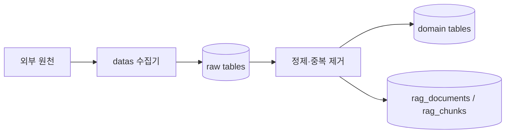

# `datas/` - 외부 금융 데이터 수집

> DART, KRX, 뉴스, 거시경제 데이터를 수집·정제해 PostgreSQL과 pgvector에 전달하는 데이터 파이프라인입니다.

## 폴더 소개

- **What:** 외부 원천별 수집기를 분리해 기업·재무·공시·시세·뉴스·거시 지표를 가져옵니다.
- **Why:** Agent가 네트워크 API를 직접 호출하지 않고 재현 가능한 저장 데이터를 사용하게 합니다.
- DART/KRX는 기업 마스터, 재무, 공시, 가격을 담당합니다.
- News는 원천 기사 적재, 정제, 임베딩 문서 준비를 담당합니다.
- Macro는 ECOS 지표를 `raw_macro`에 적재합니다.

## 기술 스택

| 영역 | 기술 |
|------|------|
| 수집 | Python, Requests, BeautifulSoup, pykrx |
| 원천 | OpenDART, KRX, 네이버 금융, ECOS |
| 저장 | PostgreSQL, JSONB, pgvector |
| 설정 | `.env`, `stock_agent.config` |

## 동작 원리



각 수집기는 자체 실행 진입점을 가지며 DB 스키마는 [`db/init/`](../db/init/README.md)이 소유합니다. 원천 payload는 가능한 한 보존하고, Agent가 사용하는 파생 필드와 임베딩은 별도 단계에서 만듭니다.

## 주요 결과와 검증

- DB 준비: `docker compose up -d db`
- 스키마 확인: `python scripts/check_db.py`
- 수집기별 입력·테이블·환경변수는 하위 README에서 확인합니다.

## 디렉토리 구조

```text
datas/
|- dart/   # DART 재무·공시와 KRX 시세
|- news/   # 뉴스 수집·전처리·임베딩
`- macro/  # ECOS 거시경제 지표
```

- [DART/KRX](dart/README.md)
- [뉴스](news/README.md)
- [거시경제](macro/README.md)
