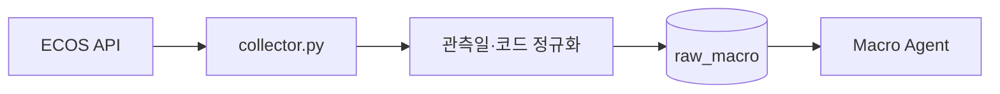

# `datas/macro/` - 거시경제 지표 수집

> 한국은행 ECOS 지표를 업종 공통 거시 맥락으로 수집해 `raw_macro`에 적재합니다.

## 폴더 소개

- **What:** 금리, 환율, 물가, 성장 지표를 기간별로 조회합니다.
- **Why:** Macro Agent와 Strategist가 숫자를 생성하지 않고 저장된 관측값을 사용하게 합니다.
- `collector.py`가 API 요청, 날짜 파싱, upsert를 한 흐름으로 수행합니다.
- 기본 수집 범위는 최근 6개월이며 지표 코드와 관측일을 함께 저장합니다.
- API 키나 DB 주소가 없으면 명확한 오류로 종료합니다.

## 기술 스택

| 기술 | 역할 |
|------|------|
| Python, Requests | ECOS API 호출과 변환 |
| PostgreSQL, psycopg2 | `raw_macro` 적재 |
| JSONB | 원천 응답 보존 |

## 동작 원리



## 실행과 검증

```bash
python datas/macro/collector.py
python scripts/check_db.py
python -m pytest tests/agents/test_macro_agent.py
```

## 디렉토리 구조

```text
datas/macro/
|- collector.py
`- README.md
```

FRED 등 공급자가 추가되면 `providers/` 하위로 분리하고 공통 적재 계약은 유지합니다.
