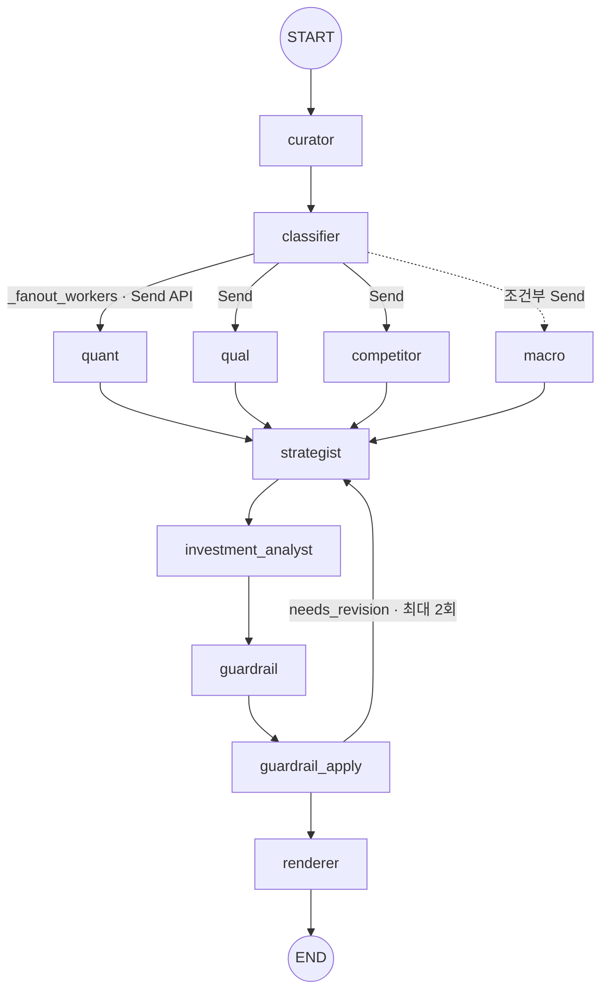

# 오케스트레이션 설계서 (Orchestration Design) — stock-agent

> 기준 코드: `src/stock_agent/graph/pipeline.py` (`build_analysis_graph()` `:388-437`)
> 기준 SSOT: [`docs/architecture/pipeline_11node_groundtruth.md`](../architecture/pipeline_11node_groundtruth.md)
> 작성: PM 문서화 트랙 (2026-06-20, 코드 읽기 기반 · 코드 미수정)

본 문서는 LangGraph `StateGraph` 위에서 11노드가 어떻게 **동적 병렬 실행(Send fan-out) → join → 합성 → 검증 → 재생성 루프**로 연결되는지, 그 설계 근거와 함께 정리합니다. 노드 인벤토리·엣지·분기 로직의 1차 기준은 SSOT이며, 이 문서는 그 "왜"를 보강합니다.

---

## 1. 전체 흐름 (정본 Mermaid)

- `START→curator→classifier` (`pipeline.py:417-418`)
- `classifier → _fanout_workers` 조건부 Send (`:423`)
- 워커 4종 → `strategist` join (`:426-429`)
- `strategist→investment_analyst→guardrail→guardrail_apply→renderer→END` (`:431-435`)

---

## 2. 설계 결정 3종 (Why)

### 2.1 Send API 동적 fan-out (`_fanout_workers`, `_worker_plan` `:154-166`)

- **무엇**: classifier가 만든 `worker_plan`에 담긴 워커에게만 `Send`를 발송 → 등록된 노드 중 **필요한 것만 병렬 실행**.
- **왜 add_edge가 아닌 Send인가**: 정적 엣지는 항상 모든 워커를 실행. Send는 런타임 상태(`analysis_scope`·`sector`)에 따라 **macro를 보낼지 말지**를 결정 → 불필요한 거시 분석 비용·지연 제거.
- **기본 워커**: `quant`·`qual`·`competitor` 항상 실행.
- **macro 조건부**: `analysis_scope ∈ {portfolio, sector}` **또는** (`single_stock` **이면서** `curator.sector` 확인). 근거(코드 주석): "개별 종목도 업종 거시경제 환경에 직접 영향받음".
- **효과**: plan에 없으면 Send 자체를 안 보냄 → macro 노드 실행 0회. 별도 스킵 분기 불필요.

### 2.2 join 후 결정적 Strategist (`_strategist_node` `:225-258`)

- **무엇**: 실행된 워커 결과를 가중 합성해 분석 신호 생성. LLM 아님(재현성·감사가능성).
- **부분 실패 허용([#51])**: 워커 일부 실패해도 `degraded=True` + 실패 노드 risk 누적으로 **계속 진행**. 한 워커 예외가 전체 파이프라인을 죽이지 않음(`_safe_worker_node` `:169-184`).
- **완전 폴백**: 예외 시 conservative `HOLD` + `fallback_used=True`.

### 2.3 Guardrail 검증 + revision loop (`_apply_guardrail_node` `:293-372`)

- **무엇**: guardrail 7게이트가 `passed = not blocked`로 위험표현·PII 판정. 통과 못 하면 **재생성 루프**.
- **루프(최대 `max_retries=2`)**: `recomposer → strategist → investment_analyst → guardrail` 재호출 (`:335-372`).
- **PII 경로**(`:303-330`): 민감정보 감지 시 headline 마스킹 + `signal=HOLD` + confidence/suitability −30 강등.
- **왜 루프인가**: LLM이 위험 표현을 낸 경우 1회성 차단이 아니라 **근거를 다시 합성**해 품질을 회복. 루프 실패해도 `worker_errors` 누적 후 진행(가용성 우선).

---

## 3. 상태(State)와 join 의미

- 단일 `AnalysisGraphState`를 모든 노드가 공유(reducer 기반 누적).
- 워커 4종은 서로 다른 키(`quant`/`qual`/`competitor`/`macro`)에 기록 → **충돌 없는 병렬 쓰기**.
- `strategist`는 4개 키가 모두 도착(join)한 뒤 실행 → LangGraph가 fan-in 동기화 담당.
- `worker_errors`는 전 구간 누적 채널 → 부분 실패·폴백을 관측 가능(평가·디버깅).

---

## 4. 에러·폴백 매트릭스 (SSOT §4 재인용)

| 지점 | 폴백/격리 | 코드 |
|---|---|---|
| 워커 4종 | try/except → `worker_errors` 누적, 전파 차단 | `:169-184` |
| strategist | 예외 시 conservative HOLD(`degraded`,`fallback_used`) | `:225-258` |
| strategist | 워커 일부 실패 시 `degraded=True` + risk 누적 | `:248-257` |
| guardrail | 예외 시 `passed=False`,`risk_level=high` | `:270-290` |
| investment_analyst | Qwen→GLM→local-rule 3단([모델 카드](model_card.md) §3) | `investment_analyst.py:79-172` |
| renderer | 예외 시 `worker_errors` 누적 | `:384-385` |

---

## 5. 설계 원칙 정리

1. **필요한 만큼만 실행** — Send 동적 fan-out으로 비용·지연 최소화(macro 조건부).
2. **부분 실패에 강건** — 워커 격리 + degraded 진행으로 가용성 확보.
3. **신호는 결정적, 표현은 게이트** — Strategist/Guardrail은 규칙 기반으로 재현성·안전성 보장, LLM은 해석·합성에만.
4. **재생성으로 품질 회복** — guardrail revision loop(≤2)로 위험 표현을 차단이 아닌 재합성으로 해소.

> 노드·엣지·분기의 1차 기준은 항상 [11노드 SSOT](../architecture/pipeline_11node_groundtruth.md)입니다. `pipeline.py`가 바뀌면 SSOT를 먼저 고치고 이 문서를 따라 갱신하세요.
