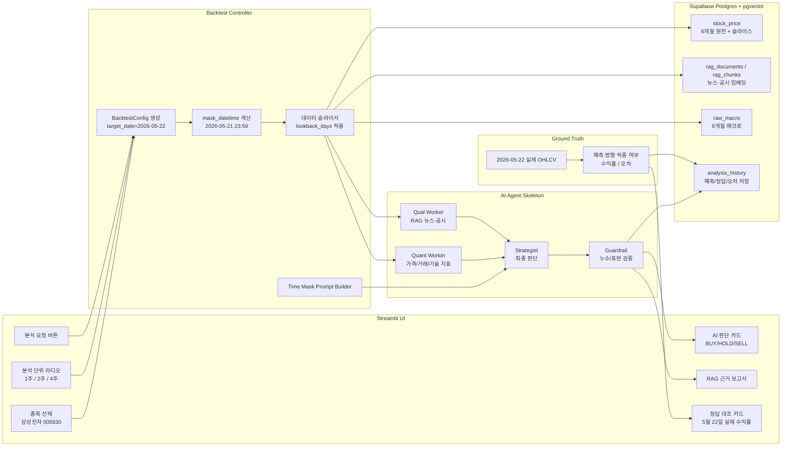
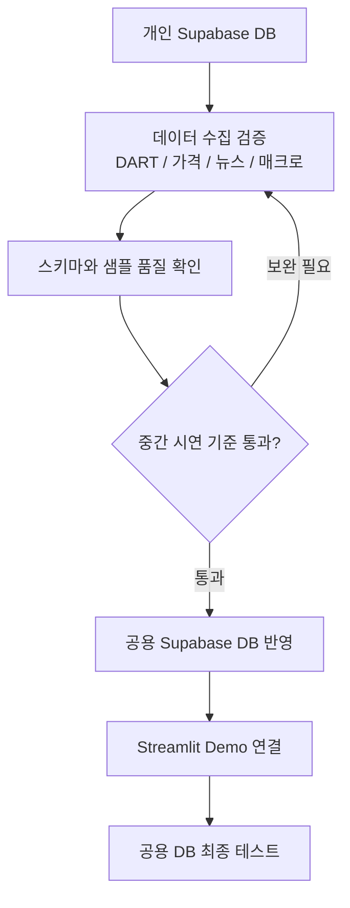

# 백테스팅 기반 AI 예측 검증 아키텍처

| 항목 | 값 |
|------|-----|
| 작성자 | PM |
| 작성일 | 2026-05-23 |
| 버전 | v0.1 |
| 상위 문서 | `docs/prd/PRD_v0.6.md` |
| 관련 명세 | `docs/functional-spec/demo/D1_backtesting_validation_spec_v0.1.md` |
| HTML 시각화 | `docs/architecture/backtesting_demo_dashboard.html` |

---

## 1. 목적

중간 시연에서는 실시간 미래 예측의 정답을 즉시 확인할 수 없다. 따라서 시연일인 **2026년 5월 23일** 기준 직전 영업일인 **2026년 5월 22일**을 타깃 예측일로 설정한다.

시스템은 AI에게 2026년 5월 21일 23:59까지의 데이터만 제공하고, 2026년 5월 22일의 실제 주가 결과는 숨긴다. AI가 산출한 BUY/HOLD/SELL 판단을 이후 실제 5월 22일 결과와 대조해, 모델의 의사결정 과정과 신뢰성을 시연한다.

---

## 2. 이번 피드백 반영 결정사항

| 결정 영역 | 확정 내용 | 설계 반영 |
|-----------|-----------|-----------|
| DART/매크로 수집 범위 | 최근 6개월 | 데이터 수집 Job은 기본 6개월 범위를 적재하고, 백테스팅 입력에는 선택 기간만 슬라이싱 |
| 벡터 DB | Supabase 단일 DB 우선 | 개인 Supabase DB에서 수집/검증 후 공용 Supabase DB에서 최종 테스트 |
| OpenRouter | 다음 주 중간 시연 이후 결정 | 초기 데모는 mock 또는 기존 LLM 추상화 계층으로 동작, OpenRouter 어댑터는 교체 가능 지점으로 문서화 |
| 시연 우선순위 | UI로 설명 가능한 데모 | Streamlit 사이드바, AI 판단 카드, 실제 결과 대조 컴포넌트를 우선 구현 |
| PM 산출물 | 명세/아키텍처/README/HTML 시각화 | 본 문서와 D1 기능 명세, HTML 대시보드로 관리 |

---

## 3. 데이터 슬리핑과 마스킹 기준

```mermaid
timeline
    title 백테스팅 시연 시간선
    2026-05-15 : 1주 분석 시작
    2026-05-21 23:59 : AI 입력 데이터 마감
    2026-05-22 : 타깃 예측일
    2026-05-23 : 시연 및 실제 결과 대조
```

| 분석 단위 | AI 입력 시작일 | AI 입력 종료일 | 타깃 예측일 | 실제 결과 대조 |
|-----------|----------------|----------------|-------------|----------------|
| 1주일 단위 분석 | 2026-05-15 | 2026-05-21 23:59 | 2026-05-22 | 5월 22일 종가/수익률 |
| 2주일 단위 분석 | 2026-05-08 | 2026-05-21 23:59 | 2026-05-22 | 5월 22일 종가/수익률 |
| 4주일 단위 분석 | 2026-04-24 | 2026-05-21 23:59 | 2026-05-22 | 5월 22일 종가/수익률 |

핵심 원칙:

- AI 컨텍스트에는 `target_date` 당일 데이터와 이후 데이터가 들어가면 안 된다.
- 뉴스, DART 공시, 주가, 매크로 데이터는 모두 `published_at <= mask_datetime` 조건을 통과해야 한다.
- 실제 결과 차트와 수익률은 AI 응답 생성 이후 별도 대조 영역에서만 표시한다.
- 프롬프트에는 현재 시점을 **2026년 5월 21일 자정에 서 있는 금융 분석가**로 고정한다.

---

## 4. 목표 아키텍처



---

## 5. 컴포넌트 책임

| 컴포넌트 | 책임 | 개발 우선순위 |
|----------|------|---------------|
| Streamlit Sidebar | 종목, 분석 단위, 타깃 날짜 표시 | P0 |
| BacktestConfig | `ticker`, `target_date`, `lookback_days`, `mask_datetime` 표준화 | P0 |
| Data Slicer | 6개월 원천 데이터에서 AI 입력 기간만 필터링 | P0 |
| Prompt Builder | 시간 페르소나와 데이터 누수 금지 문구 삽입 | P0 |
| Quant Worker Skeleton | 슬라이스된 주가 데이터로 방향성 근거 생성 | P0 |
| Qual Worker Skeleton | 슬라이스된 뉴스/공시 RAG 근거 생성 | P0 |
| Strategist | BUY/HOLD/SELL 판단과 신뢰도 산출 | P0 |
| Truth Comparator | 5월 22일 실제 수익률, 적중 여부 계산 | P0 |
| analysis_history | 예측값, 실제값, 기간 옵션, 오차 기록 | P1 |
| OpenRouter Adapter | 다음 주 회의 이후 모델 라우팅 반영 | P2 |

---

## 6. 시연 화면 구성

| 화면 영역 | 표시 내용 | 시연 메시지 |
|-----------|-----------|-------------|
| 상단 설정 | 삼성전자, 타깃 예측일 2026-05-22, 분석 단위 | "AI에게는 22일 데이터가 없는 상태로 실험합니다." |
| AI 판단 | BUY/HOLD/SELL, 신뢰도, 핵심 근거 3개 | "15일~21일 데이터만 보고 다음 날 판단을 내립니다." |
| 근거 보고서 | 주가 흐름, 뉴스/공시, 매크로 요약 | "근거 출처와 시간 범위를 함께 보여줍니다." |
| 정답 대조 | 5월 22일 실제 종가, 일간 수익률, 방향 적중 | "이미 확정된 실제 시장 결과와 즉시 대조합니다." |
| 누수 검증 배지 | `mask_datetime`, 사용 데이터 건수, 제외 데이터 건수 | "미래 데이터가 프롬프트에 들어가지 않았음을 증명합니다." |

---

## 7. 프롬프트 타임 마스킹 가이드

```text
너는 현재 2026년 5월 21일 23:59에 서 있는 금융 분석가이다.
너에게 제공된 데이터는 2026년 5월 15일부터 2026년 5월 21일 23:59까지의
삼성전자 주가, 뉴스, DART 공시, 매크로 데이터뿐이다.

2026년 5월 22일 및 그 이후의 실제 시장 결과는 알 수 없다고 가정한다.
주어진 데이터만 근거로 2026년 5월 22일의 BUY/HOLD/SELL 판단을 제시하라.
답변에는 판단, 신뢰도, 핵심 근거, 리스크, 데이터 한계를 포함하라.
```

---

## 8. Supabase 운영 흐름



운영 원칙:

- 개인 DB에서는 API 키, 수집 실패, 중복 적재, 임베딩 차원 문제를 먼저 검증한다.
- 공용 DB에는 시연에 필요한 최소 안정 데이터셋부터 반영한다.
- 공용 DB 스키마 변경은 PR과 팀 공유 후 진행한다.

---

## 9. 개발자 작업 분해

| 담당 | 작업 |
|------|------|
| 개발자 1 | DART/가격/매크로 최근 6개월 수집 Job 정리, Supabase 적재 확인 |
| 개발자 2 | 백테스팅 슬라이서, `BacktestConfig`, 실제 결과 대조 로직 구현 |
| 개발자 3 | Streamlit UI, AI 판단 카드, 정답 대조 카드, 에이전트 skeleton 연결 |
| PM 1 | D1 기능 명세, 발표 스토리보드, 누수 방지 체크리스트 관리 |
| PM 2 | 아키텍처/README/HTML 시각화, PR 리뷰, 시연 메시지 정리 |

---

## 10. 완료 기준

| 기준 | 확인 방법 |
|------|-----------|
| 1/2/4주 분석 단위가 UI에서 선택된다 | Streamlit 사이드바 라디오 동작 확인 |
| 선택 단위에 따라 입력 데이터 시작일이 달라진다 | 로그 또는 누수 검증 배지 확인 |
| AI 입력 데이터는 2026-05-21 23:59 이전만 포함된다 | 슬라이서 단위 테스트 또는 화면 데이터 건수 확인 |
| AI 판단과 실제 2026-05-22 결과가 분리 표시된다 | 화면에서 AI 카드와 정답 대조 카드가 분리되어 보임 |
| 시연자가 설명할 수 있는 HTML 아키텍처가 있다 | `backtesting_demo_dashboard.html` 브라우저 확인 |

---

## 11. 변경 이력

| 날짜 | 버전 | 변경 |
|------|------|------|
| 2026-05-23 | v0.1 | 백테스팅 기반 시연 검증 프로세스, 데이터 마스킹, Supabase 운영 흐름, UI/개발 작업 분해 반영 |
