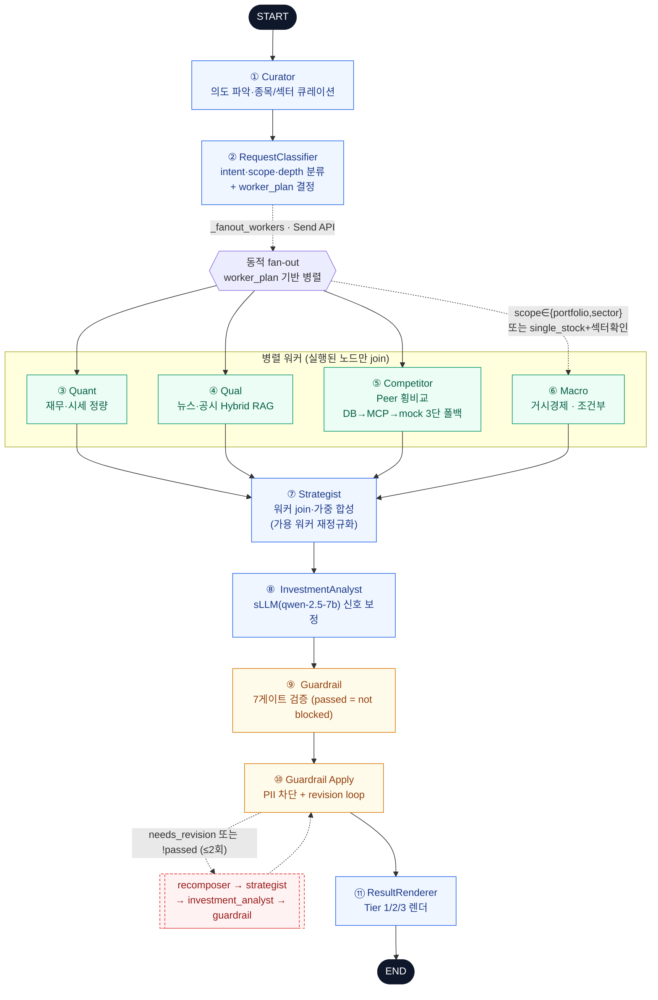
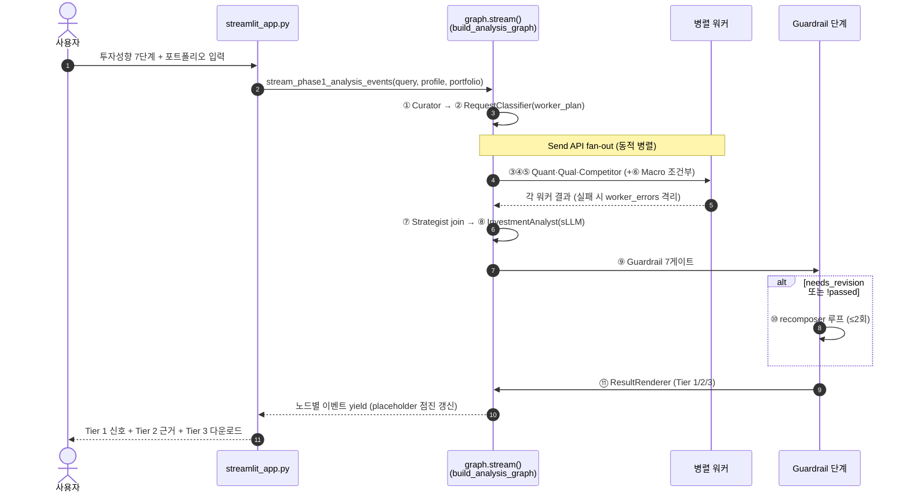
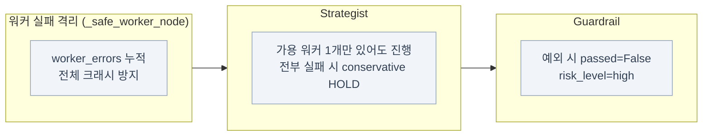
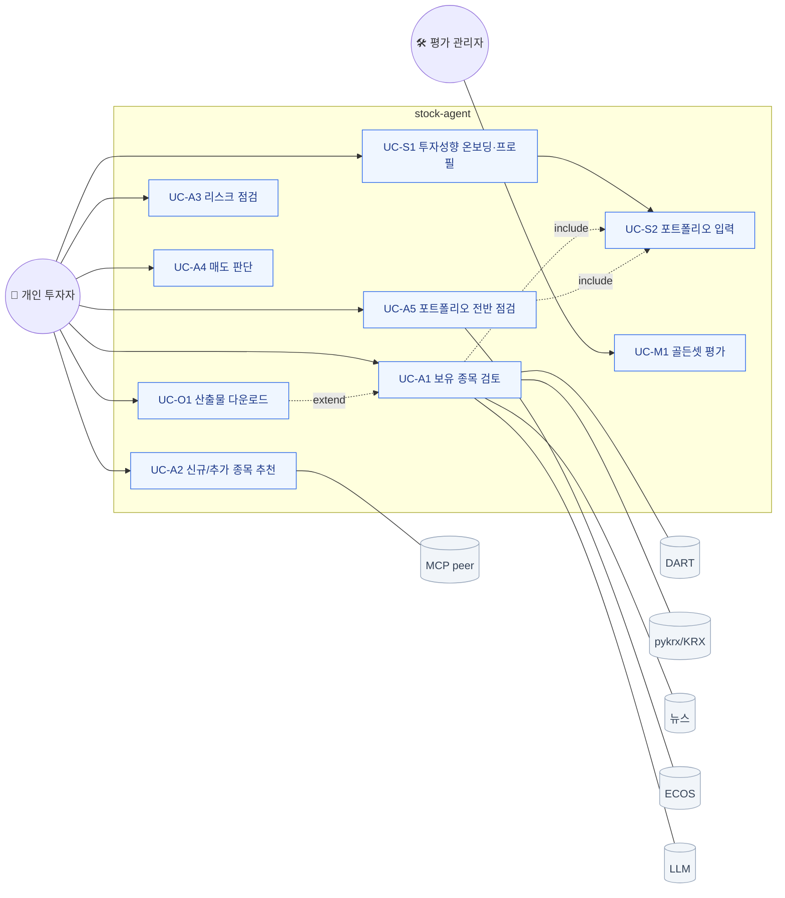

# 정본 다이어그램 (Canonical Mermaid)

> **모든 시각자료·README·설계문서가 복붙해 쓰는 단일 정본 Mermaid입니다.**
> 기준점: [`pipeline_11node_groundtruth.md`](pipeline_11node_groundtruth.md) (= `src/stock_agent/graph/pipeline.py:404-435`).
> GitHub·Obsidian·VS Code에서 그대로 렌더됩니다. PNG가 필요하면 이 코드를 이미지 변환만 하면 됩니다(내용은 이미 확정).
> 코드가 바뀌면 **이 파일을 먼저 고치고**, 각 HTML은 [`시각자료_인덱스.html`](../시각자료_인덱스.html)의 수정 포인트를 Codex에 지시해 동기화합니다.

---

## 1. 마스터 파이프라인 플로우차트 (11노드)

**읽는 법:** 실선 = 항상 실행, 점선 = 조건부. `Macro`는 worker_plan에 포함될 때만 Send가 발송돼 실행됩니다(`pipeline.py:154-166`). `Guardrail Apply` 내부의 recomposer 루프는 최대 2회입니다(`pipeline.py:335-372`).

---

## 2. 시퀀스 다이어그램 (런타임 스트리밍)

> UI는 `graph.stream()`의 노드 단위 yield를 매 이벤트마다 placeholder로 점진 렌더합니다(`streamlit_app.py:425-448`).

---

## 3. 에러핸들링·폴백 요약

근거: `pipeline.py:169-184`(격리) · `:225-258`(strategist 폴백) · `:266-290`(guardrail 폴백).

---

## 4. 사용처 (이 정본을 복붙할 대상)

| 대상 문서/HTML | 적용 다이어그램 |
|---|---|
| `README.md` 시스템 아키텍처 절 | §1 마스터 플로우차트 |
| `docs/architecture/multi_agent_architecture.md` | §1, §3 |
| `docs/architecture/system_flow.md` | §1, §2 |
| `docs/architecture/multi_agent_architecture_review.html` (Mermaid 교체) | §1 |
| `docs/architecture/system_architecture_dashboard.html` | §1 |
| `docs/ai/orchestration.md` (Phase 2) | §1, §2 |

> 교체 시 각 문서 상단에 `> 다이어그램 정본: docs/architecture/canonical_diagrams.md` 를 남긴다.

---

## 5. 유스케이스 다이어그램

> 상세: [`docs/usecase/usecase_spec.md`](../usecase/usecase_spec.md). 액터·유스케이스·외부 시스템 관계.

> `include`(점선): 분석 유스케이스는 포트폴리오 입력을 전제로 한다. `extend`: 다운로드는 분석 결과가 있을 때 확장된다.
