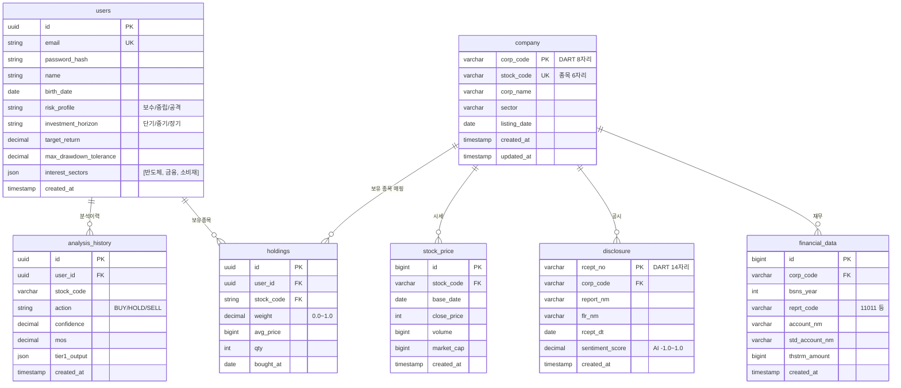

# 데이터 ERD (Entity Relationship Diagram)

| 항목 | 값 |
|------|-----|
| 작성자 | PM (데이터팀 결과 정리) |
| 작성일 | 2026-05-10 |
| 버전 | v0.1 |
| **원본 출처** | 데이터팀 노션 페이지 (변경 없이 그대로 옮김) |

---

## 0. 이 문서의 위치

> ⚠️ **중요**: 본 문서의 4 테이블 정의는 **데이터팀이 확정한 것** 입니다. PM은 *내용을 변경하지 않고 가독성만 높이는 정리* 역할이며, 스키마 변경은 데이터팀 협의 필요.

데이터팀 원본 노션: [`dart 노션 페이지`](https://www.notion.so/dart-35b0f109702680ceb527dbef6bd9a5ea)

---

## 1. 데이터 카테고리 — MVP 6개 + 후순위 3개

### 1.1 MVP 필수 6개 (Phase 1·2 동안 구축)

| # | 카테고리 | 데이터 출처 | 저장소 | 사용 에이전트 |
|---|---------|-------------|--------|----------------|
| 1 | 사용자/포트폴리오 | Streamlit 입력폼 → 회원가입 | Postgres | 모든 에이전트 (컨텍스트) |
| 2 | 종목 기본 정보 | DART + pykrx + FinanceDataReader | Postgres (`company`) | Curator·Quant |
| 3 | 가격/거래 | pykrx | Postgres (`stock_price`) | Quant·Strategist |
| 4 | DART 재무 | OpenDART API | Postgres (`financial_data`) | **Quant ⭐** |
| 5 | 뉴스 | 네이버금융·한경·매경 크롤링 | Postgres + pgvector (본문+임베딩) | **Qual ⭐** |
| 6 | 매크로 | ECOS (한은) + FRED | Postgres (시계열) | Strategist·Quant |

### 1.2 후순위 3개 (Phase 3 / v2)

| # | 카테고리 | 비고 |
|---|---------|------|
| 7 | 경쟁사/Peer | Phase 2에 *간이* 적용 (DART KSIC 섹터코드 활용). 글로벌 Peer는 v2 |
| 8 | 밸류에이션 보조 | DCF 가정 라이브러리, WACC 산업 평균 등. v2 |
| 9 | 평가/검증용 골든셋 | 페르소나 시나리오 30~50개. Phase 1 후반부에 PM이 작성 |

---

## 2. ERD 다이어그램

### 2.1 Postgres 테이블 관계



> 📌 **데이터팀 확정 4 테이블** = `company`, `financial_data`, `disclosure`, `stock_price`
> 📌 **PM 추가 제안 3 테이블** = `users`, `holdings`, `analysis_history` (회원·포트·분석 이력 — 데이터팀 협의 후 확정)

### 2.2 RAG 문서/청크 (Postgres + pgvector)

```
rag_documents
├── id (UUID)
├── source_type                 ← news / disclosure / report
├── source
├── external_id
├── corp_code / stock_code
├── title / url / published_at
├── content                     ← 정제된 원문
└── metadata (JSONB)

rag_chunks
├── id (UUID)
├── document_id                 ← rag_documents FK
├── chunk_index
├── content                     ← 청크 텍스트
├── embedding vector(1024)      ← BGE-m3 또는 Solar Embedding
├── embedding_model
└── metadata (JSONB)
```

> MVP 기본 경로는 Postgres 단일 DB입니다. Chroma는 향후 optional RAG backend로 남깁니다. 자세한 결정은 `docs/decisions/ADR-001-data-arch-postgres-pgvector.md`를 참고하세요.

---

## 3. 데이터팀 확정 4 테이블 — 상세 (변경 금지)

### 3.1 `company` — 기업 기본 정보

DART 고유 번호(`corp_code`)는 모든 API 호출의 핵심 키.

| 컬럼명 | 데이터 타입 | 제약 | 설명 | 비고 |
|--------|-------------|------|------|------|
| `corp_code` | VARCHAR(8) | **PK** | DART 고유번호 | API 호출 필수 키 |
| `stock_code` | VARCHAR(6) | UNIQUE | 상장사 종목코드 | 주가 데이터 조인용 |
| `corp_name` | VARCHAR(100) | NOT NULL | 법인명 | 기업명 |
| `sector` | VARCHAR(50) | | 산업분류 | 동종 업계(Peer) 비교용 |
| `listing_date` | DATE | | 상장일 | |
| `created_at` | TIMESTAMP | DEFAULT NOW() | 생성일시 | |
| `updated_at` | TIMESTAMP | DEFAULT NOW() ON UPDATE | 수정일시 | |

```sql
CREATE TABLE company (
    corp_code VARCHAR(8) PRIMARY KEY,
    stock_code VARCHAR(6) UNIQUE,
    corp_name VARCHAR(100) NOT NULL,
    sector VARCHAR(50),
    listing_date DATE,
    created_at TIMESTAMP DEFAULT CURRENT_TIMESTAMP,
    updated_at TIMESTAMP DEFAULT CURRENT_TIMESTAMP
);
```

### 3.2 `financial_data` — DART 재무 데이터

연도별로 데이터를 쌓아 5개년 추이 분석. Quant Worker의 핵심 입력.

| 컬럼명 | 타입 | 설명 | 비고 |
|--------|------|------|------|
| `id` | BIGINT | 고유 식별자 | PK, Auto Increment |
| `corp_code` | VARCHAR(8) | DART 고유번호 | FK → `company` |
| `bsns_year` | INT | 사업연도 | 예: 2024 |
| `reprt_code` | VARCHAR(5) | 보고서 코드 | 11011=사업보고서 |
| `account_nm` | VARCHAR(100) | 원본 계정과목명 | DART 응답 그대로 |
| `std_account_nm` | VARCHAR(50) | 표준 계정과목명 | 시스템 매핑용 |
| `thstrm_amount` | BIGINT | 당기 금액 | 조 단위 → BIGINT |
| `created_at` | TIMESTAMP | | |

```sql
CREATE TABLE financial_data (
    id BIGINT AUTO_INCREMENT PRIMARY KEY,
    corp_code VARCHAR(8) NOT NULL,
    bsns_year INT NOT NULL,
    reprt_code VARCHAR(5) NOT NULL,
    account_nm VARCHAR(100) NOT NULL,
    std_account_nm VARCHAR(50) NOT NULL,
    thstrm_amount BIGINT,
    created_at TIMESTAMP DEFAULT CURRENT_TIMESTAMP,
    FOREIGN KEY (corp_code) REFERENCES company(corp_code) ON DELETE CASCADE,
    UNIQUE KEY uk_financial (corp_code, bsns_year, reprt_code, std_account_nm),
    INDEX idx_quant_search (corp_code, std_account_nm, bsns_year)
);
```

**핵심 인덱스 의도:**
- `uk_financial`: 같은 회사·연도·계정 중복 적재 방지 (Upsert 활용)
- `idx_quant_search`: Quant Agent 의 5개년 시계열 고속 조회

### 3.3 `disclosure` — DART 공시·뉴스

Qual Worker가 RAG로 분석할 공시 메타입니다. RAG 원문과 청크는 `rag_documents`, `rag_chunks`에 저장합니다.

| 컬럼명 | 데이터 타입 | 제약 | 설명 |
|--------|-------------|------|------|
| `rcept_no` | VARCHAR(14) | **PK** | DART 접수번호 |
| `corp_code` | VARCHAR(8) | **FK** | `company.corp_code` |
| `report_nm` | VARCHAR(200) | NOT NULL | 예: 단일판매ㆍ공급계약체결 |
| `flr_nm` | VARCHAR(50) | | 제출인명 |
| `rcept_dt` | DATE | NOT NULL | 공시 접수일자 (최신순 정렬 기준) |
| `sentiment_score` | DECIMAL(3,2) | | AI 센티먼트 (-1.0 ~ 1.0) |
| `created_at` | TIMESTAMP | | |

```sql
CREATE TABLE disclosure (
    rcept_no VARCHAR(14) PRIMARY KEY,
    corp_code VARCHAR(8) NOT NULL,
    report_nm VARCHAR(200) NOT NULL,
    flr_nm VARCHAR(50),
    rcept_dt DATE NOT NULL,
    sentiment_score DECIMAL(3,2),
    created_at TIMESTAMP DEFAULT CURRENT_TIMESTAMP,
    FOREIGN KEY (corp_code) REFERENCES company(corp_code) ON DELETE CASCADE,
    INDEX idx_qual_search (corp_code, rcept_dt DESC)
);
```

### 3.4 `stock_price` — 가격·거래 데이터

pykrx 수집 + 재무와 결합해 PER/PBR 도출.

| 컬럼명 | 데이터 타입 | 제약 | 설명 |
|--------|-------------|------|------|
| `id` | BIGINT | **PK**, Auto Inc | |
| `stock_code` | VARCHAR(6) | **FK** | `company.stock_code` |
| `base_date` | DATE | NOT NULL | 영업일자 |
| `close_price` | INT | NOT NULL | 종가 |
| `volume` | BIGINT | | 거래량 |
| `market_cap` | BIGINT | | 시가총액 (밸류에이션 필수) |
| `created_at` | TIMESTAMP | | |

```sql
CREATE TABLE stock_price (
    id BIGINT AUTO_INCREMENT PRIMARY KEY,
    stock_code VARCHAR(6) NOT NULL,
    base_date DATE NOT NULL,
    close_price INT NOT NULL,
    volume BIGINT,
    market_cap BIGINT,
    created_at TIMESTAMP DEFAULT CURRENT_TIMESTAMP,
    FOREIGN KEY (stock_code) REFERENCES company(stock_code) ON DELETE CASCADE,
    UNIQUE KEY uk_price (stock_code, base_date),
    INDEX idx_price_search (stock_code, base_date DESC)
);
```

---

## 4. 에이전트별 데이터 사용 케이스 (PM 정리)

> 데이터팀 자료의 *에이전트별 수집 데이터* 를 표로 압축. 누가 어떤 데이터를 쓰는지 한눈에.

### 4.1 Curator Agent (종목 후보 선정)

| 필요 데이터 | 출처 테이블·컬렉션 | 사용 |
|-------------|---------------------|------|
| 종목 universe (KOSPI/KOSDAQ) | `company` | 분석 가능 종목 목록 |
| 시가총액 | `stock_price.market_cap` | 작은 종목 제외 (시총 ≥1조) |
| 거래대금 | `stock_price.volume × close_price` | 유동성 필터 (20거래일 평균) |
| 섹터 | `company.sector` | 사용자 관심 섹터 매칭 |
| 최근 뉴스 수 | `rag_documents` 카운트 | 이슈성 판단 |
| 회원 관심 섹터 | `users.interest_sectors` | 우선 노출 |

**MVP 필터:** 반도체·금융·소비재 시총 상위 9 종목 (PRD §3.5)

### 4.2 Qual Worker Agent (정성 분석 ★ 핵심)

| 필요 데이터 | 출처 | 사용 |
|-------------|------|------|
| 뉴스 본문 | `rag_chunks` + pgvector | RAG 검색 → 호재/악재 추출 |
| 뉴스 메타 | `rag_documents` | 출처·날짜 인용 |
| 공시 본문 | `rag_chunks` + pgvector | DART 사업보고서 RAG |
| 공시 메타 | `disclosure` | 보고서명·접수일 인용 |

**저장 예시 (뉴스):**
```json
{
  "ticker": "005930",
  "title": "삼성전자, AI 반도체 수요 회복 기대",
  "published_at": "2026-05-08",
  "publisher": "예시경제",
  "url": "https://example.com/news/123",
  "event_type": "industry_trend",
  "sentiment": "positive",
  "summary": "AI 서버 투자 확대에 따라 메모리 수요 회복 기대"
}
```

### 4.3 Quant Worker Agent (정량 분석)

| 필요 데이터 | 출처 | 사용 |
|-------------|------|------|
| 5y 손익계산서 | `financial_data` (account_nm: 매출액/영업이익/당기순이익) | 5y 추세 + 추정 |
| 5y 재무상태표 | `financial_data` (자산·부채·자본) | ROE·부채비율 |
| 5y 현금흐름표 | `financial_data` (영업CF·투자CF·CAPEX) | FCF 계산 |
| 시세 | `stock_price` (1년 일봉) | PER·PBR + 모멘텀·변동성 |
| 시가총액 | `stock_price.market_cap` | 밸류에이션 곱셈 |

**MVP 수집 범위 (데이터팀):** 최근 3개년 연간 + 최근 4개 분기 → Phase 2에서 5개년 확장

**MVP 추천 지표:**
- 1개월 / 3개월 수익률
- 20일 평균 거래대금
- 20일 변동성
- 52주 고점 대비 하락률

### 4.4 Competitor Agent (Phase 2 — 동종업계 비교)

| 필요 데이터 | 출처 | 사용 |
|-------------|------|------|
| 같은 섹터 종목 리스트 | `company.sector` GROUP BY | Peer 자동 추출 |
| Peer 재무 | `financial_data` JOIN `company` | PER·ROE·매출성장 비교 |
| Peer 시세 | `stock_price` | 시총·주가 추세 비교 |

### 4.5 Strategist & Synthesizer Agent

| 필요 데이터 | 출처 | 사용 |
|-------------|------|------|
| 4 워커 결과 | LangGraph State (메모리) | 종합 |
| 회원 프로필 + 포트 | `users`, `holdings` | 적합도 매칭 |
| 매크로 (금리·환율·CPI) | Postgres 매크로 시계열 | 거시 컨텍스트 주입 |

### 4.6 Guardrail & Evaluator Agent

| 필요 데이터 | 출처 | 사용 |
|-------------|------|------|
| 욕설·금지어 사전 | `db/init/` 또는 코드 상수 | 출력 필터 |
| 골든셋 시나리오 | `eval/golden_set/` | RAGAS 채점 입력 |

---

## 5. 매크로 데이터 — MVP 수집 범위 (데이터팀 자료)

| 데이터 | MVP 포함? | 용도 |
|--------|-----------|------|
| 한국 기준금리 | ✅ | 금융주 영향 |
| 미국 기준금리 | ✅ | 성장주·반도체 영향 |
| 원/달러 환율 | ✅ | 수출주 (반도체) |
| KOSPI 지수 | ✅ | 시장 분위기 |
| Nasdaq | ✅ | 반도체 글로벌 위험선호 |
| WTI 유가 | ⚠ Phase 2 | (3섹터엔 영향 적음) |
| 미국 10년물 금리 | ✅ | 성장주 밸류 |
| CPI/물가 | ✅ | 소비재 영향 |

### 섹터별 매크로 매핑 (MVP 3섹터)

| 섹터 | 핵심 매크로 |
|------|-------------|
| **반도체** | 환율 (수출 영향) · 미국 금리 · Nasdaq · 글로벌 IT 투자 |
| **금융** | 한국 기준금리 · 장단기 금리차 |
| **소비재** | 물가 (CPI) · 환율 (원자재 수입) · 소비심리 |

---

## 6. 변경 이력

| 날짜 | 버전 | 변경 |
|------|------|------|
| 2026-05-10 | v0.1 | 초안 — 데이터팀 4 테이블 그대로 + PM 추가 제안 3 테이블 + 에이전트 사용 케이스 + ERD Mermaid |

---

## 7. 데이터팀에 확인 요청 사항

> PM이 정리하면서 모호한 부분이 있어, 데이터팀 검토가 필요한 항목입니다.

1. **`users`, `holdings`, `analysis_history` 3 테이블 추가 필요** — 회원가입·포트·분석 이력 저장용. 데이터팀이 추가 작성? 아니면 백엔드 담당? **답변 요청**
2. **뉴스 메타 테이블** — 데이터팀 자료에는 뉴스 저장 예시(JSON)만 있고 SQL 스키마가 없음. `disclosure` 와 별개의 `news` 테이블이 필요한지? **답변 요청**
3. **임베딩 모델과 차원** — 현재 스키마는 `bge-m3`, `vector(1024)` 기준. 모델 변경 시 데이터팀·에이전트팀 합의 필요 **답변 요청**
4. **5개년 vs 3개년** — 데이터팀 자료는 "MVP는 3개년" 이라고 했는데 PRD/교수 피드백은 "5개년 밸류에이션" 요구. Phase 1=3년, Phase 2=5년 확장으로 단계화 어떨지? **답변 요청**

---

> **본 문서의 4 테이블(`company`·`financial_data`·`disclosure`·`stock_price`) 정의는 데이터팀이 확정한 원본이며, PM은 가독성만 정리했습니다.**
