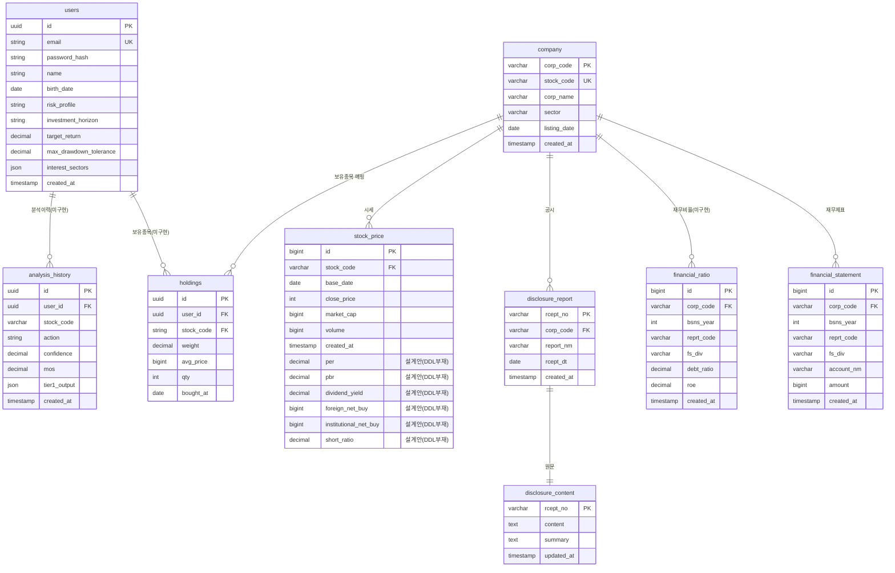

# 데이터 ERD (Entity Relationship Diagram)

| 항목 | 값 |
|------|-----|
| 작성자 | PM (데이터팀 결과 정리) |
| 작성일 | 2026-05-10 |
| 버전 | v0.2 |
| **원본 출처** | 데이터팀 노션 페이지 (변경 없이 그대로 옮김) |
| 코드 정합 | 2026-06-13 — `financial_data`→`financial_statement` 정정, 미구현 테이블 명시. **2026-06-20 — `disclosure_report`·`disclosure_content` DDL 부재(❌ 미구현) 정정, `stock_price` 6투자지표 컬럼 DDL 부재(설계안) 정정, 실제 7테이블 확정** (강사 06-20 코드 우선 피드백 반영) |

---

## 0. 이 문서의 위치

> ⚠️ **중요**: 본 문서의 4 테이블 정의는 **데이터팀이 확정한 것** 입니다. PM은 *내용을 변경하지 않고 가독성만 높이는 정리* 역할이며, 스키마 변경은 데이터팀 협의 필요.

데이터팀 원본 노션: [`dart 노션 페이지`](https://www.notion.so/dart-35b0f109702680ceb527dbef6bd9a5ea)

---

## 0.1 구현 상태 (코드 기준)

> 강사 검토 피드백(#4 "ERD ↔ 실제 SQL 불일치, 코드 우선 감점") 반영. 아래 표는 본 ERD의 각 테이블이 **실제 `db/init/` DDL에 존재하는지**를 코드 기준으로 정리한 정합표입니다. 상충 시 **실제 SQL이 우선**입니다.

| 테이블 | db/init DDL | 정의 위치 | 비고 |
|--------|:-----------:|-----------|------|
| `company` | ✅ 존재 | `001_create_raw_tables.sql` | 종목 마스터 |
| `stock_price` | ⚠️ 부분 | `001_...sql` | DDL은 **close_price·market_cap·volume**만. per·pbr·dividend_yield·외국인/기관순매수·short_ratio **6컬럼은 DDL 부재(설계안)** — §3.2 참고 |
| `financial_statement` | ✅ 존재 | `001_...sql` | DART 재무(구 표기 `financial_data` 아님) |
| `disclosure_report` | ❌ **미구현** | (DDL 없음) | 강사 06-20 지적 반영 — `db/init/*.sql`에 CREATE 없음. 수집/런타임 경로만 |
| `disclosure_content` | ❌ **미구현** | (DDL 없음) | 동일 — DDL 부재. §3.6은 설계안 |
| `rag_documents` | ✅ 존재 | `002_*.sql` | RAG 문서 |
| `rag_chunks` | ✅ 존재 | `002_*.sql` | RAG 청크 `vector(1024)` |
| `raw_news` / `raw_macro` | ✅ 존재 | `001_...sql` | 수집 원천 |
| `financial_ratio` | ❌ 미구현 | (DDL 없음) | 3.4는 **설계안** — 현재 비율은 `financial_statement`에서 파생 계산 |
| `users` / `holdings` / `analysis_history` | ❌ 미구현 | (DDL 없음) | 런타임 Pydantic 객체만 존재(2.1 제안 테이블) |

> **실제 `db/init/` CREATE TABLE 7종(코드 확정)**: `raw_news`·`raw_macro`·`company`·`stock_price`·`financial_statement`(001) / `rag_documents`·`rag_chunks`(002). 그 외는 모두 설계안(미구현).

---

## 1. 데이터 카테고리 — MVP 6개 + 후순위 3개

### 1.1 MVP 필수 6개 (Phase 1·2 동안 구축)

| # | 카테고리 | 데이터 출처 | 저장소 | 사용 에이전트 |
|---|---------|-------------|--------|----------------|
| 1 | 사용자/포트폴리오 | Streamlit 입력폼 → 회원가입 | Postgres | 모든 에이전트 (컨텍스트) |
| 2 | 종목 기본 정보 | DART + pykrx + FinanceDataReader | Postgres (`company`) | Curator·Quant |
| 3 | 가격/거래 | pykrx | Postgres (`stock_price`) | Quant·Strategist |
| 4 | DART 재무 | OpenDART API | Postgres (`financial_statement`) | **Quant ⭐** |
| 5 | 뉴스 | 네이버금융·한경·매경 크롤링 | Postgres + pgvector (본문+임베딩) | **Qual ⭐** |
| 6 | 매크로 | ECOS (한은) + FRED | Postgres (시계열) | Strategist·Quant |

### 1.2 후순위 3개 (Phase 3 / v2)

| # | 카테고리 | 비고 |
|---|---------|------|
| 7 | 경쟁사/Peer | Phase 2에 *간이* 적용 (DART KSIC 섹터코드 활용). 글로벌 Peer는 v2 |
| 8 | 밸류에이션 보조 | DCF 가정 라이브러리, WACC 산업 평균 등. v2 |
| 9 | 평가/검증용 골든셋 | 페르소나 시나리오 30~50개. Phase 1 후반부에 PM이 작성 |

---

## 2. ERD 다이어그램

### 2.1 Postgres 테이블 관계



> 📌 **db/init에 실제 존재(코드 기준)** = `company`, `stock_price`, `financial_statement`, `disclosure_report`, `disclosure_content`, `rag_documents`, `rag_chunks`, `raw_news`, `raw_macro`
> 📌 **설계만(미구현)** = `financial_ratio`(파생 재무비율 — DDL 미작성), `users`·`holdings`·`analysis_history`(회원·포트·분석 이력 — 현재 런타임 Pydantic만, DDL 미작성). 위 mermaid에서 점선/제안 표기로 읽으세요.
>
> ⚠️ 정합 기준: 상충 시 **실제 SQL(`db/init/`)이 우선**입니다. 자세한 매핑은 아래 [0.1 구현 상태](#01-구현-상태-코드-기준)를 참고하세요.

### 2.2 RAG 문서/청크 (Postgres + pgvector)

```
rag_documents
├── id (UUID)
├── source_type                 ← news / disclosure / report
├── source
├── external_id
├── corp_code / stock_code
├── title / url / published_at
├── content                     ← 정제된 원문
└── metadata (JSONB)

rag_chunks
├── id (UUID)
├── document_id                 ← rag_documents FK
├── chunk_index
├── content                     ← 청크 텍스트
├── embedding vector(1024)      ← BGE-m3 또는 Solar Embedding
├── embedding_model
└── metadata (JSONB)
```

> MVP 기본 경로는 Postgres 단일 DB입니다. Chroma는 향후 optional RAG backend로 남깁니다. 자세한 결정은 `docs/decisions/ADR-001-data-arch-postgres-pgvector.md`를 참고하세요.

---

## 3. 데이터팀 확정 6 테이블 — 상세 (변경 금지)

## 3.1 company

기업 기본 정보(Master Data)

| 컬럼명 | 타입 | 설명 |
|---------|---------|---------|
| corp_code | VARCHAR(8) | DART 고유번호(PK) |
| stock_code | VARCHAR(6) | 종목코드(UNIQUE) |
| corp_name | VARCHAR(100) | 기업명 |
| sector | VARCHAR(50) | 산업분류 |
| listing_date | DATE | 상장일 |
| created_at | TIMESTAMPTZ | 생성일시 |

```sql
CREATE TABLE company (
    corp_code VARCHAR(8) PRIMARY KEY,
    stock_code VARCHAR(6) UNIQUE,
    corp_name VARCHAR(100) NOT NULL,
    sector VARCHAR(50),
    listing_date DATE,
    created_at TIMESTAMPTZ DEFAULT NOW()
);
```

---

## 3.2 stock_price

일별 시세 및 투자/수급 지표

> ⚠️ **코드 우선 정합(2026-06-20)**: 실제 `db/init/001_create_raw_tables.sql:44-54`의 `stock_price`는 **`close_price`·`market_cap`·`volume`** 3개 fact 컬럼만 있습니다. 아래 표의 `per`·`pbr`·`dividend_yield`·`foreign_net_buy`·`institutional_net_buy`·`short_ratio` **6개는 DDL에 없는 설계안**입니다(강사 06-20 지적). 현재 PER/PBR은 MCP `market_metrics` 또는 파생 계산으로 충당.

| 컬럼명 | 타입 | 설명 |
|---------|---------|---------|
| id | BIGSERIAL | PK |
| stock_code | VARCHAR(6) | 종목코드(FK) |
| base_date | DATE | 거래일 |
| close_price | INT | 종가 |
| market_cap | BIGINT | 시가총액 |
| volume | BIGINT | 거래량 |
| per | NUMERIC | PER |
| pbr | NUMERIC | PBR |
| dividend_yield | NUMERIC | 배당수익률 |
| foreign_net_buy | BIGINT | 외국인 순매수 |
| institutional_net_buy | BIGINT | 기관 순매수 |
| short_ratio | NUMERIC | 공매도 비율 |

```sql
CREATE TABLE stock_price (
    id BIGSERIAL PRIMARY KEY,
    stock_code VARCHAR(6) NOT NULL,
    base_date DATE NOT NULL,
    close_price INT NOT NULL,
    market_cap BIGINT,
    volume BIGINT,
    per NUMERIC,
    pbr NUMERIC,
    dividend_yield NUMERIC,
    foreign_net_buy BIGINT,
    institutional_net_buy BIGINT,
    short_ratio NUMERIC,
    created_at TIMESTAMPTZ DEFAULT NOW(),

    FOREIGN KEY (stock_code)
        REFERENCES company(stock_code)
        ON DELETE CASCADE,

    CONSTRAINT uk_stock_price
        UNIQUE (stock_code, base_date)
);
```

---

## 3.3 financial_statement

원시 재무제표 데이터

| 컬럼명 | 타입 | 설명 |
|---------|---------|---------|
| id | BIGSERIAL | PK |
| corp_code | VARCHAR(8) | 기업코드(FK) |
| bsns_year | INT | 사업연도 |
| reprt_code | VARCHAR(5) | 보고서코드 |
| fs_div | VARCHAR(3) | 연결/별도 |
| account_nm | VARCHAR(100) | 계정과목 |
| amount | BIGINT | 금액 |

```sql
CREATE TABLE financial_statement (
    id BIGSERIAL PRIMARY KEY,
    corp_code VARCHAR(8) NOT NULL,
    bsns_year INT NOT NULL,
    reprt_code VARCHAR(5) NOT NULL,
    fs_div VARCHAR(3) NOT NULL,
    account_nm VARCHAR(100) NOT NULL,
    amount BIGINT,
    created_at TIMESTAMPTZ DEFAULT NOW(),

    FOREIGN KEY (corp_code)
        REFERENCES company(corp_code)
        ON DELETE CASCADE
);
```

---

## 3.4 financial_ratio ⚠️ 설계안 (DDL 미작성)

> **코드 기준 주의**: 이 테이블은 `db/init/`에 **아직 존재하지 않습니다.** 현재 부채비율·ROE 등 비율은 별도 테이블 없이 `financial_statement` 계정값에서 파생 계산합니다. 아래 정의는 향후 도입 시의 설계안입니다.

파생 재무비율 데이터

| 컬럼명 | 타입 | 설명 |
|---------|---------|---------|
| id | BIGSERIAL | PK |
| corp_code | VARCHAR(8) | 기업코드(FK) |
| bsns_year | INT | 사업연도 |
| reprt_code | VARCHAR(5) | 보고서코드 |
| fs_div | VARCHAR(3) | 연결/별도 |
| debt_ratio | NUMERIC | 부채비율 |
| roe | NUMERIC | 자기자본이익률 |

```sql
CREATE TABLE financial_ratio (
    id BIGSERIAL PRIMARY KEY,
    corp_code VARCHAR(8) NOT NULL,
    bsns_year INT NOT NULL,
    reprt_code VARCHAR(5) NOT NULL,
    fs_div VARCHAR(3) NOT NULL,
    debt_ratio NUMERIC,
    roe NUMERIC,
    created_at TIMESTAMPTZ DEFAULT NOW(),

    FOREIGN KEY (corp_code)
        REFERENCES company(corp_code)
        ON DELETE CASCADE,

    CONSTRAINT uk_financial_ratio
        UNIQUE (corp_code, bsns_year, reprt_code, fs_div)
);
```

---

## 3.5 disclosure_report ⚠️ 설계안 (DDL 미작성)

> **코드 우선 정합(2026-06-20)**: `disclosure_report`는 `db/init/`에 **CREATE TABLE이 없습니다**(강사 06-20 지적). 아래는 도입 시 설계안이며, 현재 공시 데이터는 수집 경로·`rag_documents`(source_type=disclosure)로 흐릅니다.

공시 메타데이터

| 컬럼명 | 타입 | 설명 |
|---------|---------|---------|
| rcept_no | VARCHAR(14) | 접수번호(PK) |
| corp_code | VARCHAR(8) | 기업코드(FK) |
| report_nm | VARCHAR(200) | 공시명 |
| rcept_dt | DATE | 공시일 |

```sql
CREATE TABLE disclosure_report (
    rcept_no VARCHAR(14) PRIMARY KEY,
    corp_code VARCHAR(8) NOT NULL,
    report_nm VARCHAR(200) NOT NULL,
    rcept_dt DATE NOT NULL,
    created_at TIMESTAMPTZ DEFAULT NOW(),

    FOREIGN KEY (corp_code)
        REFERENCES company(corp_code)
        ON DELETE CASCADE
);
```

---

## 3.6 disclosure_content ⚠️ 설계안 (DDL 미작성)

> **코드 우선 정합(2026-06-20)**: `disclosure_content`도 `db/init/`에 CREATE TABLE이 없습니다. 아래는 설계안.

공시 원문 및 AI 요약

| 컬럼명 | 타입 | 설명 |
|---------|---------|---------|
| rcept_no | VARCHAR(14) | 공시번호(PK/FK) |
| content | TEXT | 공시 원문 |
| summary | TEXT | AI 요약 |

```sql
CREATE TABLE disclosure_content (
    rcept_no VARCHAR(14) PRIMARY KEY,
    content TEXT,
    summary TEXT,
    updated_at TIMESTAMPTZ DEFAULT NOW(),

    FOREIGN KEY (rcept_no)
        REFERENCES disclosure_report(rcept_no)
        ON DELETE CASCADE
);
```

---

# 인덱스

```sql
CREATE INDEX idx_stock_price_search
ON stock_price (stock_code, base_date DESC);

CREATE INDEX idx_fs_search
ON financial_statement (corp_code, bsns_year, account_nm);

CREATE INDEX idx_report_date
ON disclosure_report (corp_code, rcept_dt DESC);
```
## 4. 에이전트별 데이터 사용 케이스 (PM 정리)

> 데이터팀 자료의 *에이전트별 수집 데이터* 를 표로 압축. 누가 어떤 데이터를 쓰는지 한눈에.

### 4.1 Curator Agent (종목 후보 선정)

| 필요 데이터 | 출처 테이블·컬렉션 | 사용 |
|-------------|---------------------|------|
| 종목 universe (KOSPI/KOSDAQ) | `company` | 분석 가능 종목 목록 |
| 시가총액 | `stock_price.market_cap` | 작은 종목 제외 (시총 ≥1조) |
| 거래대금 | `stock_price.volume × close_price` | 유동성 필터 (20거래일 평균) |
| 섹터 | `company.sector` | 사용자 관심 섹터 매칭 |
| 최근 뉴스 수 | `rag_documents` 카운트 | 이슈성 판단 |
| 회원 관심 섹터 | `users.interest_sectors` | 우선 노출 |

**MVP 필터:** 반도체·금융·소비재 시총 상위 9 종목 (PRD §3.5)

### 4.2 Qual Worker Agent (정성 분석 ★ 핵심)

| 필요 데이터 | 출처 | 사용 |
|-------------|------|------|
| 뉴스 본문 | `rag_chunks` + pgvector | RAG 검색 → 호재/악재 추출 |
| 뉴스 메타 | `rag_documents` | 출처·날짜 인용 |
| 공시 본문 | `rag_chunks` + pgvector | DART 사업보고서 RAG |
| 공시 메타 | `disclosure_report` | 보고서명·접수일 인용 |

**저장 예시 (뉴스):**
```json
{
  "ticker": "005930",
  "title": "삼성전자, AI 반도체 수요 회복 기대",
  "published_at": "2026-05-08",
  "publisher": "예시경제",
  "url": "https://example.com/news/123",
  "event_type": "industry_trend",
  "sentiment": "positive",
  "summary": "AI 서버 투자 확대에 따라 메모리 수요 회복 기대"
}
```

### 4.3 Quant Worker Agent (정량 분석)

| 필요 데이터 | 출처 | 사용 |
|-------------|------|------|
| 5y 손익계산서 | `financial_statement` (account_nm: 매출액/영업이익/당기순이익) | 5y 추세 + 추정 |
| 5y 재무상태표 | `financial_statement` (자산·부채·자본) | ROE·부채비율 |
| 5y 현금흐름표 | `financial_statement` (영업CF·투자CF·CAPEX) | FCF 계산 |
| 시세 | `stock_price` (1년 일봉) | PER·PBR + 모멘텀·변동성 |
| 시가총액 | `stock_price.market_cap` | 밸류에이션 곱셈 |

**MVP 수집 범위 (데이터팀):** 최근 3개년 연간 + 최근 4개 분기 → Phase 2에서 5개년 확장

**MVP 추천 지표:**
- 1개월 / 3개월 수익률
- 20일 평균 거래대금
- 20일 변동성
- 52주 고점 대비 하락률

### 4.4 Competitor Agent (Phase 2 — 동종업계 비교)

| 필요 데이터 | 출처 | 사용 |
|-------------|------|------|
| 같은 섹터 종목 리스트 | `company.sector` GROUP BY | Peer 자동 추출 |
| Peer 재무 | `financial_statement` JOIN `company` | PER·ROE·매출성장 비교 |
| Peer 시세 | `stock_price` | 시총·주가 추세 비교 |

### 4.5 Strategist & Synthesizer Agent

| 필요 데이터 | 출처 | 사용 |
|-------------|------|------|
| 4 워커 결과 | LangGraph State (메모리) | 종합 |
| 회원 프로필 + 포트 | `users`, `holdings` | 적합도 매칭 |
| 매크로 (금리·환율·CPI) | Postgres 매크로 시계열 | 거시 컨텍스트 주입 |

### 4.6 Guardrail & Evaluator Agent

| 필요 데이터 | 출처 | 사용 |
|-------------|------|------|
| 욕설·금지어 사전 | `db/init/` 또는 코드 상수 | 출력 필터 |
| 골든셋 시나리오 | `eval/golden_set/` | RAGAS 채점 입력 |

---

## 5. 매크로 데이터 — MVP 수집 범위 (데이터팀 자료)

| 데이터 | MVP 포함? | 용도 |
|--------|-----------|------|
| 한국 기준금리 | ✅ | 금융주 영향 |
| 미국 기준금리 | ✅ | 성장주·반도체 영향 |
| 원/달러 환율 | ✅ | 수출주 (반도체) |
| KOSPI 지수 | ✅ | 시장 분위기 |
| Nasdaq | ✅ | 반도체 글로벌 위험선호 |
| WTI 유가 | ⚠ Phase 2 | (3섹터엔 영향 적음) |
| 미국 10년물 금리 | ✅ | 성장주 밸류 |
| CPI/물가 | ✅ | 소비재 영향 |

### 섹터별 매크로 매핑 (MVP 3섹터)

| 섹터 | 핵심 매크로 |
|------|-------------|
| **반도체** | 환율 (수출 영향) · 미국 금리 · Nasdaq · 글로벌 IT 투자 |
| **금융** | 한국 기준금리 · 장단기 금리차 |
| **소비재** | 물가 (CPI) · 환율 (원자재 수입) · 소비심리 |

---

## 6. 변경 이력

| 날짜 | 버전 | 변경 |
|------|------|------|
| 2026-06-20 | v0.3 | **코드 우선 정합** — `disclosure_report`/`disclosure_content` DDL 부재 정정(❌ 미구현), `stock_price` 6투자지표 컬럼 설계안 표기, §0.1 정합표·§2.1 Mermaid·§3.2/3.5/3.6 동기화 (강사 06-20 지적) |
| 2026-06-13 | v0.2 | `financial_data`→`financial_statement` 정정, 미구현 테이블 명시 |
| 2026-05-10 | v0.1 | 초안 — 데이터팀 4 테이블 그대로 + PM 추가 제안 3 테이블 + 에이전트 사용 케이스 + ERD Mermaid |

---

## 7. 데이터팀에 확인 요청 사항

> PM이 정리하면서 모호한 부분이 있어, 데이터팀 검토가 필요한 항목입니다.

1. **`users`, `holdings`, `analysis_history` 3 테이블 추가 필요** — 회원가입·포트·분석 이력 저장용. 데이터팀이 추가 작성? 아니면 백엔드 담당? **답변 요청**
2. **뉴스 메타 테이블** — 데이터팀 자료에는 뉴스 저장 예시(JSON)만 있고 SQL 스키마가 없음. `disclosure_report` 와 별개의 `news` 테이블이 필요한지? (현재는 `raw_news`·`rag_documents`로 수집) **답변 요청**
3. **임베딩 모델과 차원** — 현재 스키마는 `bge-m3`, `vector(1024)` 기준. 모델 변경 시 데이터팀·에이전트팀 합의 필요 **답변 요청**
4. **5개년 vs 3개년** — 데이터팀 자료는 "MVP는 3개년" 이라고 했는데 PRD/교수 피드백은 "5개년 밸류에이션" 요구. Phase 1=3년, Phase 2=5년 확장으로 단계화 어떨지? **답변 요청**

---

> **본 문서의 핵심 테이블(`company`·`financial_statement`·`disclosure_report`·`disclosure_content`·`stock_price`) 정의는 데이터팀이 확정한 원본이며, PM은 가독성과 코드 정합만 정리했습니다.** (구 표기 `financial_data`·`disclosure`는 실제 SQL 기준으로 정정)
