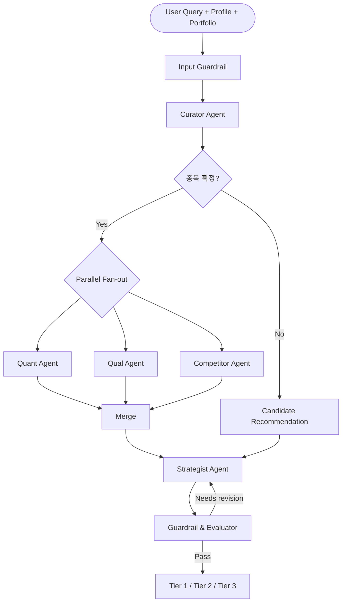

# 멀티 에이전트 아키텍처 설계

| 항목 | 값 |
|------|-----|
| 작성 목적 | 개발팀 논의와 구현 기준 정리 |
| 기준 문서 | `docs/prd/PRD_v0.6.md`, `docs/architecture/system_flow.md`, `docs/decisions/ADR-003-six-agent-structure.md` |
| 관련 HTML | `docs/architecture/multi_agent_architecture_review.html` |
| 현재 구현 기준 | Phase 1 mock pipeline |
| 목표 구현 기준 | LangGraph 기반 supervisor graph + 병렬 fan-out |
| 최종 갱신 | 2026-05-25 |

---

## 1. 한 줄 결론

우리 프로젝트의 멀티 에이전트는 자유롭게 대화하는 AI 집단이 아니라, **개인 투자자의 포트폴리오 맥락에서 정량·정성·Peer·리스크를 분리 분석한 뒤, 근거 기반 분석 신호를 생성하는 금융 의사결정 보조 파이프라인**이다.

MVP에서는 완전 분산형 A2A 구조보다 다음 형태가 가장 안전하다.

```text
Curator
→ Quant / Qual / Competitor 병렬 분석
→ Strategist 종합
→ Guardrail 검증
→ Tier 1/2/3 출력
```

핵심 원칙은 다음과 같다.

| 원칙 | 설명 |
|------|------|
| Supervisor pattern | Strategist가 전체 분석 결과를 종합하고 최종 신호를 만든다. |
| Specialist agents | Quant, Qual, Competitor는 각자 전문 영역만 담당한다. |
| Evidence-first | 모든 정성 판단은 출처와 연결되어야 한다. |
| Calculation outside LLM | PER, PBR, ROE, valuation 등 숫자는 Python/DB가 계산한다. |
| Structured contract | Agent 간 전달은 Pydantic schema 기반으로 한다. |
| Financial guardrails | 투자 권유성 표현, 수익 보장, 출처 없는 단정을 막는다. |

---

## 2. 현재 구현과 목표 구현

### 2.1 현재 구현

현재 `src/stock_agent/graph/pipeline.py`는 다음 순서로 mock agent를 실행한다.

```text
run_curator
→ run_quant
→ run_qual
→ run_competitor
→ run_strategist
→ run_guardrail
```

현재 구현의 의미는 “최종 구조의 입출력 계약을 검증하는 Phase 1 skeleton”이다. 실제 LangGraph 병렬 실행, 실제 DB 조회, 실제 LLM 호출, 실제 RAG 검색은 아직 연결되지 않았다.

### 2.2 목표 구현

목표 구조는 LangGraph `StateGraph` 기반이다.



---

## 3. AgentState 계약

멀티 에이전트에서 가장 중요한 것은 agent 개수가 아니라 **공유 state 계약**이다. 모든 agent는 같은 `AgentState`를 읽고, 자신의 결과만 채운다.

### 3.1 현재 주요 필드

현재 `src/stock_agent/schemas/analysis.py` 기준:

| 필드 | 역할 |
|------|------|
| `user_query` | 사용자 자연어 질문 |
| `user_profile` | 위험성향, 투자기간, 관심 섹터 |
| `portfolio` | 보유 종목과 현금 비중 |
| `curator` | 종목/의도 파싱 결과 |
| `quant` | 정량 분석 결과 |
| `qual` | 정성/RAG 분석 결과 |
| `competitor` | Peer 비교 결과 |
| `strategist` | 종합 분석 신호 |
| `guardrail` | 최종 안전 검증 결과 |

### 3.2 추가 권장 필드

금융 분석 시스템으로 가려면 다음 필드가 필요하다.

| 필드 | 설명 | 필요한 이유 |
|------|------|-------------|
| `request_id` | 분석 요청 고유 ID | 로그, 비용, 평가, 디버깅 연결 |
| `as_of_date` | 분석 기준일 | 백테스트와 미래 데이터 차단 |
| `data_version` | 사용 데이터 스냅샷 버전 | 결과 재현성 |
| `mode` | `cache`, `live`, `backtest`, `debug` | 실행 정책 분리 |
| `target_stock_code` | 분석 대상 KRX 종목코드 | agent 간 공통 키 |
| `target_corp_code` | DART 기업 코드 | 재무/공시 연결 |
| `evidence_bundle` | 사용된 출처 묶음 | 출처 검증과 RAG 평가 |
| `cost_trace` | agent별 token/cost | 월 5만원 비용 상한 관리 |
| `errors` | 부분 실패 목록 | fallback과 운영 디버깅 |
| `warnings` | 데이터 부족/근거 부족 경고 | UI와 Guardrail 표시 |

개발팀은 schema 변경 시 전체 agent에 영향이 있으므로 PR에서 반드시 공유해야 한다.

---

## 4. Agent별 책임

## 4.1 Curator Agent

Curator는 사용자의 자연어를 시스템이 처리 가능한 분석 요청으로 바꾼다.

| 구분 | 내용 |
|------|------|
| 입력 | `user_query`, `user_profile`, `portfolio`, `company` |
| 주요 DB | `company`, 선택적으로 `stock_price`, `holdings` |
| 출력 | `intent`, `stock_code`, `corp_code`, `corp_name`, `sector`, `candidates` |

해야 할 일:

1. 사용자 질문에서 종목명 또는 종목코드 추출
2. 질문 의도 분류
3. `company` 테이블에서 종목 확정
4. 종목명이 애매하면 후보 목록 반환
5. 종목 미지정이면 사용자 성향과 관심 섹터 기반 후보 추천

Prompt 원칙:

```text
너는 한국 주식 분석 시스템의 Curator Agent다.
사용자 질문에서 의도, 종목, 섹터, 필요한 분석 타입을 구조화한다.
모르면 추측하지 말고 candidates에 후보를 넣는다.
반드시 정해진 JSON schema에 맞춰 출력한다.
```

주의:

- 종목을 임의로 확정하지 않는다.
- `stock_code`는 KRX 6자리 문자열로 반환한다.
- `corp_code`는 DART 연결을 위해 함께 반환한다.

---

## 4.2 Quant Agent

Quant는 숫자와 valuation을 담당한다. LLM이 계산하지 않고, Python과 DB 쿼리로 계산한다.

| 구분 | 내용 |
|------|------|
| 입력 | `stock_code`, `corp_code`, `as_of_date` |
| 주요 DB | `stock_price`, `financial_statement`, `raw_macro` |
| 출력 | `score`, `valuation_signal`, `metrics`, `reasons`, `risks` |

해야 할 일:

1. 최근 가격, 시가총액, 거래량 조회
2. DART 재무제표 조회
3. PER, PBR, ROE, 매출 성장률, 영업이익률 계산
4. 5년 valuation 시나리오 계산
5. 현재가 대비 안전마진 계산
6. 숫자 기반 정량 신호 생성

Prompt 원칙:

```text
너는 Quant Worker다.
주어진 계산 결과를 바탕으로 정량적 해석만 작성한다.
계산값을 새로 만들거나 추정하지 않는다.
데이터가 부족하면 부족하다고 명시한다.
투자 권유가 아니라 분석 신호로 표현한다.
```

주의:

- 수치 계산은 `financial_tool`, `price_tool`에서 처리한다.
- LLM은 결과 설명과 리스크 문장 생성에만 사용한다.
- 데이터 부족 시 confidence를 낮춘다.

---

## 4.3 Qual Agent

Qual은 뉴스, 공시, 리포트 등 비정형 텍스트를 RAG로 분석한다.

| 구분 | 내용 |
|------|------|
| 입력 | `stock_code`, `corp_code`, `query intent` |
| 주요 DB | `rag_documents`, `rag_chunks`, `disclosure_report`, `disclosure_content`, `raw_news` |
| 출력 | `score`, `sentiment`, `event_types`, `evidence`, `risks`, `sources` |

해야 할 일:

1. `stock_code` 기준으로 최근 뉴스/공시 검색
2. `pgvector` similarity search 실행
3. 검색 결과를 호재/악재/중립으로 분류
4. 이벤트 유형 분류
5. 출처 기반 요약 생성
6. 출처가 부족하면 confidence를 낮춤

Prompt 원칙:

```text
너는 Qual Worker다.
검색된 뉴스/공시 chunk만 근거로 사용한다.
출처에 없는 사실은 말하지 않는다.
각 근거마다 source title, date, url 또는 document_id를 붙인다.
호재와 악재를 균형 있게 정리한다.
```

주의:

- RAG 결과가 없으면 “근거 없음”으로 반환한다.
- 뉴스 제목만 보고 단정하지 않는다.
- `src/stock_agent/rag/pgvector_store.py`의 검색 함수를 우선 연결한다.

---

## 4.4 Competitor Agent

Competitor는 동종업계 Peer 비교를 담당한다.

| 구분 | 내용 |
|------|------|
| 입력 | `stock_code`, `sector`, 재무/시세 데이터 |
| 주요 DB | `company`, `stock_price`, `financial_statement` |
| 출력 | `score`, `peer_summary`, `peers`, `evidence` |

해야 할 일:

1. 같은 sector에서 peer 후보 조회
2. 시총, 거래량, 데이터 완성도 기준으로 peer 3~5개 선택
3. PER, PBR, ROE, 성장률, margin 비교
4. 대상 종목의 상대 위치 판단

Prompt 원칙:

```text
너는 Competitor Agent다.
대상 기업을 같은 섹터 peer와 비교한다.
비교 가능한 지표만 사용한다.
데이터가 없는 peer는 제외하거나 결측으로 표시한다.
상대적 위치를 명확히 설명한다.
```

주의:

- peer 선정 기준을 결과에 남긴다.
- MVP에서는 국내 peer 중심으로 제한한다.
- 결측치를 임의 보간하지 않는다.

---

## 4.5 Strategist Agent

Strategist는 전체 분석의 supervisor다. Quant, Qual, Competitor 결과를 사용자 포트폴리오 맥락으로 종합한다.

| 구분 | 내용 |
|------|------|
| 입력 | `curator`, `quant`, `qual`, `competitor`, `user_profile`, `portfolio` |
| 주요 DB | 직접 DB 조회 최소화. 필요 시 portfolio/cache 정도만 조회 |
| 출력 | `signal`, `confidence`, `suitability`, `headline`, `key_reasons`, `risks`, `next_actions` |

해야 할 일:

1. 정량, 정성, Peer 결과 병합
2. 사용자 위험성향 반영
3. 포트폴리오 내 대상 종목 비중 확인
4. 현금 비중 확인
5. 종목 신호와 포트폴리오 적합도 분리
6. BUY/HOLD/SELL 성격의 분석 신호 생성
7. 5가지 관점 self-critique 수행

Self-critique 관점:

| 관점 | 질문 |
|------|------|
| 회계 보수주의 | 재무 가정이 과도하게 낙관적인가? |
| 매크로 비관 | 금리, 환율, 경기 둔화 리스크를 반영했는가? |
| 경쟁구도 회의론 | Peer 대비 경쟁력이 과장되었는가? |
| 규제/ESG | 규제, 소송, ESG 리스크가 빠졌는가? |
| 모멘텀 | 단기 과열 또는 하락 추세가 있는가? |

Prompt 원칙:

```text
너는 Strategist & Synthesizer Agent다.
Quant, Qual, Competitor 결과를 종합하되, 사용자의 포트폴리오와 위험성향을 반드시 반영한다.
BUY/HOLD/SELL은 투자 권유가 아니라 분석 신호로 표현한다.
근거가 약하면 confidence를 낮추고 HOLD로 보수화한다.
최종 결론 전에 5가지 반대 관점으로 자체 검토한다.
```

주의:

- `signal`과 `suitability`는 다르다.
- 종목 자체가 좋아도 이미 보유 비중이 높으면 suitability가 낮아질 수 있다.
- `BUY`인데 confidence가 낮으면 `HOLD`로 보수화한다.

---

## 4.6 Guardrail & Evaluator Agent

Guardrail은 마지막 문장 수정기가 아니라 금융 시스템의 안전 계층이다.

| 구분 | 내용 |
|------|------|
| 입력 | `strategist_result`, `evidence_bundle`, `user_query`, policy rules |
| 주요 DB | `evidence_log`, `agent_run_log`, 선택적으로 `analysis_history` |
| 출력 | `passed`, `warnings`, `revised_headline`, `disclaimer`, `eval_scores` |

해야 할 일:

1. 투자 권유성 표현 완화
2. 수익 보장 표현 차단
3. 출처 없는 단정 탐지
4. PII/욕설/광고성 입력 처리
5. 근거 부족 시 warning 추가
6. 최종 disclaimer 부착
7. 평가 지표 기록

Guardrail 계층:

| 계층 | 역할 |
|------|------|
| Input Guardrail | PII, 욕설, 자동매매 요청, 비정상 입력 차단 |
| Tool Guardrail | DB 조회 범위, 외부 API 호출, 비용, 권한 확인 |
| Output Guardrail | 투자 권유 표현, 수익 보장, 출처 없는 주장 차단 |

Prompt 원칙:

```text
너는 금융 AI Guardrail Agent다.
출력물이 투자 권유, 수익 보장, 허위 단정, 출처 없는 주장에 해당하는지 검사한다.
위험 표현은 완화하되 핵심 정보는 유지한다.
필요하면 passed=false로 반환한다.
```

---

## 5. DB와 Agent 매핑

| 테이블 | 역할 | 사용 Agent |
|--------|------|------------|
| `company` | 기업 마스터, 종목코드, 섹터 | Curator, Quant, Competitor |
| `stock_price` | 일별 종가, 시총, 거래량 | Quant, Competitor, Guardrail |
| `financial_statement` | 재무제표 계정별 수치 | Quant, Competitor |
| `disclosure_report` | DART 공시 메타 | Qual |
| `disclosure_content` | 공시 원문/요약 | Qual |
| `raw_news` | 뉴스 원천 데이터 | Qual |
| `raw_macro` | 금리, 환율, 경기 지표 | Quant, Strategist |
| `rag_documents` | RAG 문서 단위 | Qual |
| `rag_chunks` | RAG chunk와 embedding | Qual |

추가 권장 테이블:

| 테이블 | 목적 |
|--------|------|
| `analysis_cache` | 같은 종목/사용자/기준일의 분석 결과 재사용 |
| `analysis_history` | 과거 분석 결과 저장 |
| `llm_cost_log` | agent별 token/cost 기록 |
| `agent_run_log` | agent 실행 상태와 오류 기록 |
| `evidence_log` | 최종 결과에 사용된 출처 기록 |

---

## 6. Prompt 관리 구조

프롬프트는 코드에 직접 쓰지 않는다. PM과 기획자도 검토할 수 있도록 markdown으로 분리한다.

추천 구조:

```text
src/stock_agent/prompts/
├── curator/
│   ├── system.md
│   └── output_schema.md
├── quant/
│   ├── system.md
│   └── explanation.md
├── qual/
│   ├── system.md
│   └── rag_summary.md
├── competitor/
│   └── system.md
├── strategist/
│   ├── system.md
│   ├── self_critique.md
│   └── tier_output.md
└── guardrail/
    ├── system.md
    └── finance_policy.md
```

공통 prompt 규칙:

1. 역할을 명확히 한다.
2. 사용할 수 있는 데이터 범위를 제한한다.
3. 모르면 모른다고 한다.
4. JSON/Pydantic schema에 맞춰 출력한다.
5. 투자 권유가 아니라 분석 신호라고 명시한다.
6. 출처 없는 사실 생성을 금지한다.
7. confidence를 낮출 조건을 명시한다.

---

## 7. Tool 분리 기준

`agents/`에는 판단 흐름을 두고, `tools/`에는 DB 조회, API 호출, 계산식을 둔다.

| Tool | 기능 | 사용 Agent |
|------|------|------------|
| `company_tool.py` | 종목 검색, corp_code/stock_code 조회 | Curator, Competitor |
| `price_tool.py` | 최근 가격, 가격 히스토리, 모멘텀 계산 | Quant, Competitor |
| `financial_tool.py` | 재무제표 조회, PER/PBR/ROE, valuation 계산 | Quant, Competitor |
| `rag_tool.py` | 뉴스/공시 chunk 검색, source bundle 반환 | Qual |
| `peer_tool.py` | 동종업계 peer 선정, 비교 지표 생성 | Competitor |
| `macro_tool.py` | 금리/환율/경기 context 생성 | Quant, Strategist |
| `cache_tool.py` | 분석 캐시 조회/저장 | Pipeline, Strategist |

원칙:

- Tool은 가능한 순수 함수로 작성한다.
- 외부 API 호출은 cache 우선이다.
- API key는 `.env`에서만 읽는다.
- Tool output은 schema로 감싼다.

---

## 8. 실행 모드

| 모드 | 설명 | 사용 시점 |
|------|------|-----------|
| `cache` | `analysis_cache` 결과 반환 | 발표 시연, 비용 절감 |
| `live` | DB/RAG/LLM 실제 호출 | 실제 분석 |
| `backtest` | 특정 `as_of_date` 기준으로 미래 데이터 차단 | 검증 데모 |
| `debug` | agent별 중간 state 노출 | 개발/평가 |

---

## 9. 출력 구조

사용자 출력은 Tier 1/2/3로 나눈다.

| Tier | 내용 | 목적 |
|------|------|------|
| Tier 1 | 한 줄 결론, signal, confidence, suitability, disclaimer | 빠른 의사결정 보조 |
| Tier 2 | 정량, 정성, Peer, 포트폴리오, 리스크 근거 카드 | “왜?”에 대한 답 |
| Tier 3 | PDF/DOCX, valuation Excel, 산업/뉴스 HTML | 깊은 검토와 공유 |

주의:

- Tier 1 결론과 Tier 3 리포트 결론은 일치해야 한다.
- Tier 2의 모든 근거는 evidence와 연결되어야 한다.
- UI에는 “투자 권유가 아닌 분석 신호” disclaimer가 항상 있어야 한다.

---

## 10. 평가 지표

| 지표 | 의미 | 목표 |
|------|------|------|
| Schema Valid Rate | 모든 agent output이 schema를 통과하는 비율 | 95%+ |
| Source Attachment Rate | 근거 문장에 source가 붙은 비율 | 95%+ |
| RAG Faithfulness | Qual 요약이 검색 chunk에 근거하는 정도 | 0.80+ |
| Action Consistency | 같은 입력 5회 반복 시 signal 일치율 | 80%+ |
| Guardrail Block Rate | 금지 표현/자동매매 요청 차단 성공률 | 100% |
| Latency | 캐시/live 응답 시간 | 캐시 5초, live 60초 |
| Cost Per Run | 1회 분석 비용과 agent별 비용 비중 | 월 5만원 이하 |
| Tier Consistency | Tier 1과 Tier 3 결론 일치율 | 90%+ |

---

## 11. 개발팀 작업 우선순위

1. `AgentState`와 agent result schema 확정
2. DB table과 agent input/output 매핑 확정
3. Prompt 폴더 구조 확정
4. Tool 책임 분리 확정
5. LangGraph node/edge 설계 확정
6. Evidence, audit, cost log 설계 확정
7. Golden set과 평가 지표 확정
8. mock agent를 실제 DB/LLM/tool 연결로 교체

---

## 12. 변경 이력

| 날짜 | 변경 |
|------|------|
| 2026-05-25 | 멀티 에이전트 아키텍처, agent 책임, DB 매핑, prompt/tool/guardrail/evaluation 기준 정리 |
