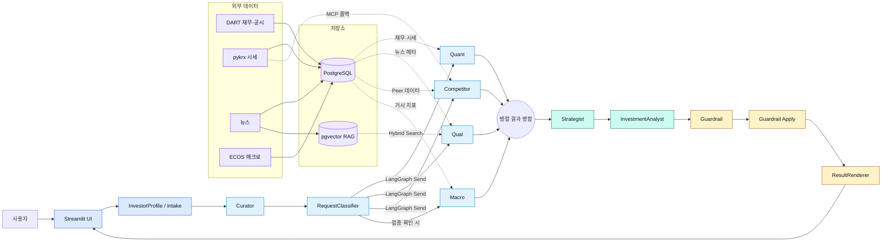

# README 시스템 아키텍처

> 기준일: 2026-06-20 
> 사실 기준: `streamlit_app.py`, `src/stock_agent/graph/pipeline.py`, `db/init/`

이 문서는 루트 README에 사용하는 시스템 구성도의 정확한 원본입니다. 생성형 이미지보다 이 Mermaid를 구조의 기준으로 사용합니다.

## 동작 원리

1. Streamlit이 7단계 온보딩과 포트폴리오를 받아 `UserProfile`과 `Portfolio`를 만든다.
2. Curator와 RequestClassifier가 종목·업종·질문 범위·긴급도·분석 깊이를 정한다.
3. LangGraph `Send`가 Quant, Qual, Competitor를 병렬 실행하고, 업종이 확인되면 Macro도 포함한다.
4. Strategist가 전문 Agent 결과를 합성하고 InvestmentAnalyst가 LLM 또는 규칙 기반 폴백으로 표현을 보정한다.
5. Guardrail이 투자 권유 표현과 위험 문구를 검사한 뒤 ResultRenderer가 Tier 1/2/3 결과와 다운로드 산출물을 만든다.

## 장애 격리와 폴백

- 전문 Agent 하나가 실패해도 `worker_errors`에 기록하고 나머지 결과로 보수적 분석을 계속한다.
- Strategist 실패 시 신뢰도와 적합도를 낮춘 `HOLD` 결과를 반환한다.
- InvestmentAnalyst의 외부 LLM 호출이 불가능하면 기존 Strategist 결과를 사용한다.
- Competitor는 DB 조회 후 MCP 실시간 시세, 마지막으로 mock 순서의 폴백을 사용한다.
- Guardrail 실패 또는 수정 필요 상태에서는 재합성·감점·마스킹 규칙을 적용한다.

## 관련 문서

- [전체 시스템 흐름](system_flow.md)
- [멀티 에이전트 구조](multi_agent_architecture.md)
- [DB ERD](erd.md)
- [기능 구현 상태](../functional-spec/IMPLEMENTATION_STATUS.md)
