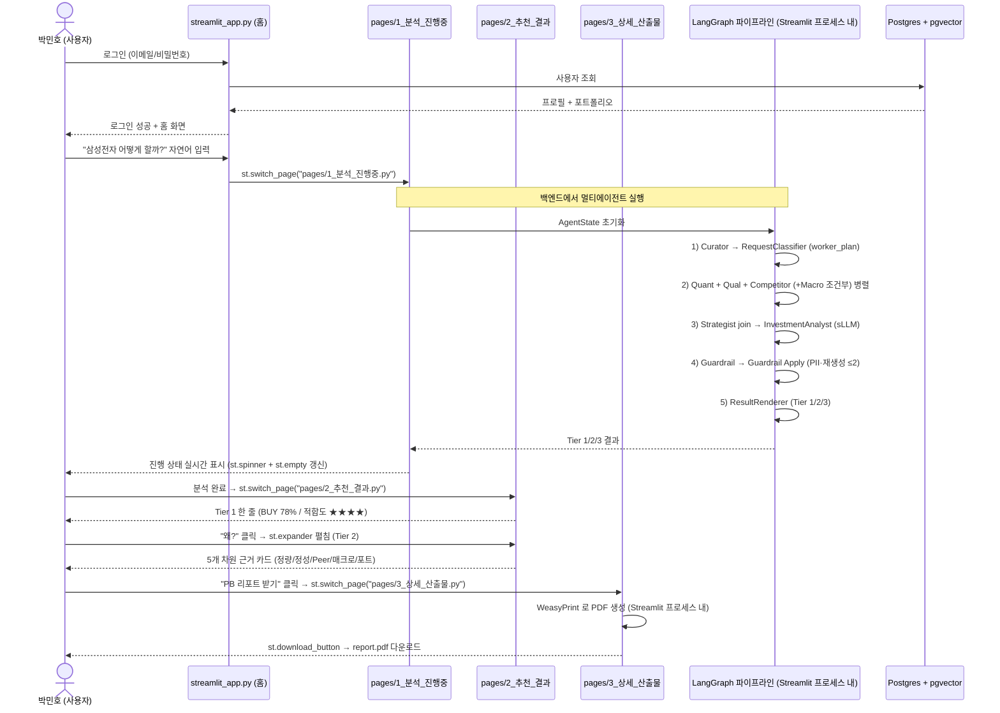
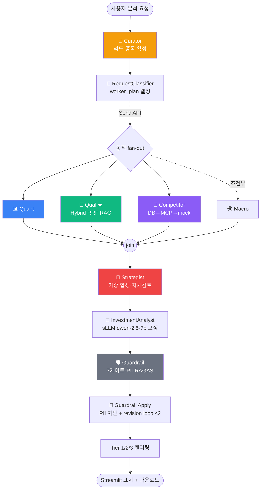
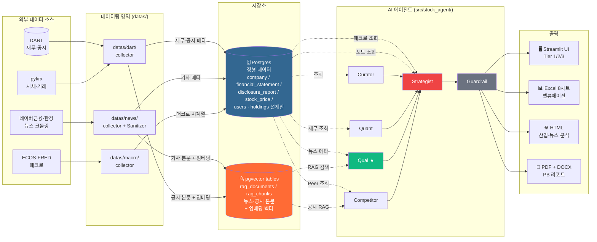
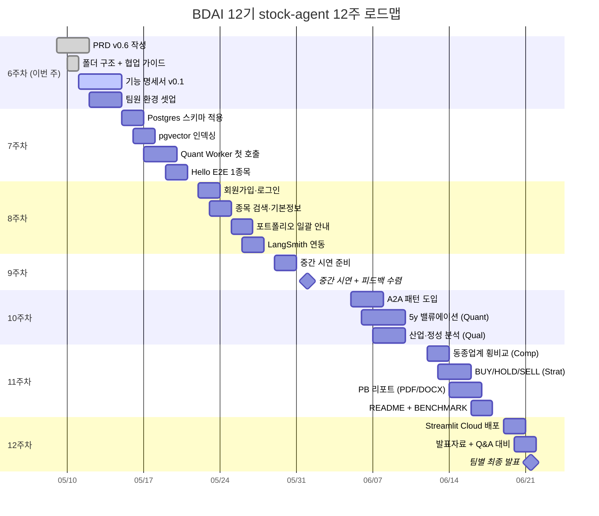
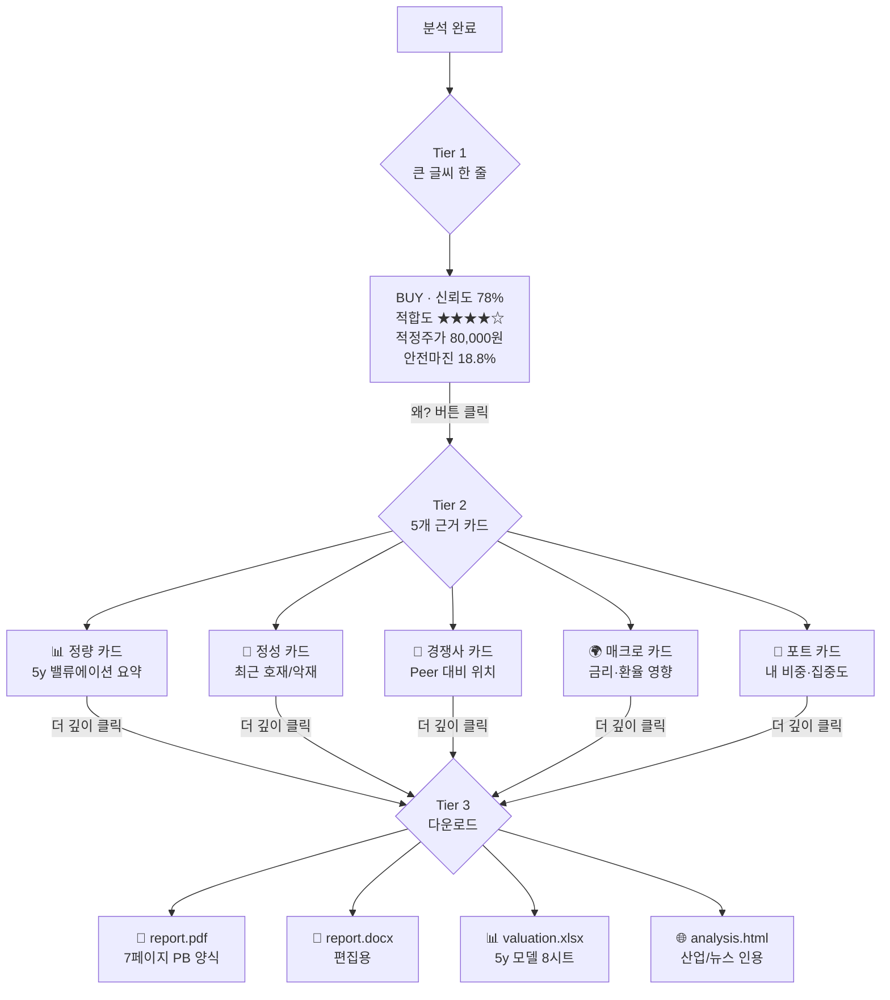
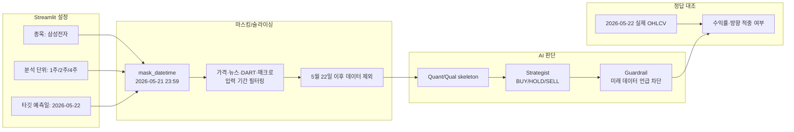

# 시스템 흐름도

| 항목 | 값 |
|------|-----|
| 작성자 | PM |
| 작성일 | 2026-05-10 |
| 버전 | v0.1 |
| 상위 문서 | `docs/prd/PRD_v0.6.md` |

---

## 0. 이 문서를 보는 법

본 문서에는 **Mermaid 다이어그램** 4종이 들어 있습니다. GitHub·VSCode·Obsidian에서 자동으로 그림으로 렌더링됩니다.

> Mermaid가 안 보이고 코드만 보인다면, GitHub 웹에서 보거나 Mermaid 플러그인을 설치하세요. 변경 시 `https://mermaid.live` 에서 실시간 미리보기 가능.

비전공자 팀원께: 이 4장 흐름도를 보면 **시스템이 어떻게 동작하는지** 큰 그림을 잡을 수 있습니다. 코드를 안 봐도 됩니다.

| # | 다이어그램 | 어떤 시점에서 보면 좋은가 |
|---|-----------|---------------------------|
| 1 | **사용자 시나리오 흐름** (Sequence) | "사용자가 화면에서 어떤 순서로 행동하는가?" |
| 2 | **LangGraph 노드 흐름** (Flowchart) | "AI 에이전트들은 어떤 순서로 일하는가?" |
| 3 | **데이터 플로우** (Architecture) | "데이터가 어디서 와서 어디로 가는가?" |
| 4 | **12주 일정** (Gantt) | "언제 무엇을 하는가?" |

> 최신 멀티 에이전트 상세 설계와 팀 회의용 HTML은 `docs/architecture/multi_agent_architecture.md`,
> `docs/architecture/multi_agent_architecture_review.html`을 함께 참고한다.

---

## 0.1 현행 구현 상태 (11노드 LangGraph)

> 기준 코드(SSOT): [`pipeline_11node_groundtruth.md`](pipeline_11node_groundtruth.md) · 다이어그램 정본 [`canonical_diagrams.md`](canonical_diagrams.md). 본 문서 초안(2026-05-10)의 "mock 순차/목표" 기술은 아래로 갱신됨.

현재 코드는 **11노드 LangGraph `StateGraph`**가 실동작한다(`graph/pipeline.py:404-435`). classifier가 `worker_plan`을 정하고 Send API로 워커를 동적 병렬 실행, strategist에서 join한다.

```text
Curator → RequestClassifier → [Quant·Qual·Competitor (+Macro 조건부) 병렬]
→ Strategist(join) → InvestmentAnalyst → Guardrail → Guardrail Apply → ResultRenderer
```

| 영역 | 현행 |
|------|------|
| Graph | LangGraph `StateGraph` 11노드 컴파일 |
| 병렬화 | `_fanout_workers`(Send API) 동적 병렬, macro는 조건부 |
| 전문 Agent | DB/Tool/LLM/RAG 연결(워커별 try/except 격리) |
| RAG | Qual이 Hybrid RRF retriever 실호출 |
| sLLM | InvestmentAnalyst qwen-2.5-7b 보정 |
| Guardrail | 7게이트 + PII 차단 + recomposer revision loop(≤2) |

---

## 1. 사용자 시나리오 흐름 — 박민호 페르소나 (Sequence Diagram)

> 박민호(균형형 투자자)가 "내 포트에서 삼성전자 어떻게 할까?" 를 묻는 시나리오. 화면 → 시스템 → 화면의 흐름을 시간 순서대로.



---

## 2. LangGraph 노드 흐름 (Flowchart)

> AI 에이전트들이 어떤 순서로 협업하는지. **11노드** + Send API 동적 병렬 fan-out. (정본: [`canonical_diagrams.md`](canonical_diagrams.md) §1)



**핵심 설명:**
- 🎯 Curator → 🧭 RequestClassifier가 scope·depth로 `worker_plan`을 결정 (macro 포함 여부)
- 📊 Quant + 📰 Qual + 🏢 Competitor (+🌍 Macro 조건부) → **Send API 동적 병렬**. 실행된 워커만 join
- 🎲 Strategist → 가중 합성 + 자체 검토 → 🤖 InvestmentAnalyst가 sLLM으로 최종 보정 (Critic 분리 안 한 이유는 `ADR-002`)
- 🛡 Guardrail → 🔁 Guardrail Apply에서 PII 차단·recomposer 재생성 루프(≤2). 백그라운드 RAGAS 채점

---

## 3. 데이터 플로우 (Architecture Diagram)

> 데이터가 어디서 들어와서 → 어디에 저장되고 → 어떻게 쓰이는지.



**핵심 설명 (비전공자용):**
- **외부 → 데이터팀 → 저장소** 경로: 매일 한 번 (또는 사용자 요청 시) 데이터 수집 → 깨끗하게 정리 → DB에 적재
- **Postgres 안에서 역할을 나눈 이유**:
  - **Postgres (왼쪽 파란색)** = 표 형태로 잘 정리된 데이터 (회원·재무·시세·매크로)
  - **pgvector tables (오른쪽 주황)** = 긴 텍스트 + 의미 벡터를 Postgres 안에 저장 → "비슷한 뉴스 찾아줘" 가능
- **에이전트 → 저장소** 경로: 분석 요청이 오면 에이전트들이 필요한 데이터를 조회 → 결과를 만들어서 → 사용자에게 4가지 형태로 제공

---

## 4. 12주 일정 (Gantt Chart)

> 강사 가이드 12주 + 우리 작업 매핑



---

## 5. 부속 — 사용자가 보는 Tier 1/2/3 진행 (시각화)

> 분석 종료 후 사용자에게 *어떤 순서로 정보가 펼쳐지는지*



**Progressive Disclosure (점진적 공개) 원칙**: Tier 1만 봐도 결정 가능. Tier 2는 "왜?" 의 답. Tier 3은 "더 깊이" 의 답. 인지부하 1/3로 줄임.

---

## 6. 부속 — 백테스팅 기반 시연 검증 흐름

> 중간 시연에서는 실제 미래 예측을 즉시 검증할 수 없으므로, 2026년 5월 22일을 타깃 예측일로 두고 AI 입력 데이터는 2026년 5월 21일 23:59 이전으로 마스킹한다.



자세한 설계는 `docs/architecture/backtesting_demo_architecture.md`, 발표용 HTML은 `docs/architecture/backtesting_demo_dashboard.html`을 참고한다.

---

## 변경 이력

| 날짜 | 버전 | 변경 |
|------|------|------|
| 2026-06-20 | v0.3 | **11노드 정합** — §0.1 현행 상태, §1 시퀀스 단계, §2 노드 흐름도를 11노드 LangGraph(classifier·macro·investment_analyst·guardrail_apply·renderer 포함)로 갱신. 정본 다이어그램 연결 |
| 2026-05-23 | v0.2 | 5월 22일 타깃 예측일 기반 백테스팅 시연 검증 흐름 추가 |
| 2026-05-10 | v0.1 | 초안 — 4종 Mermaid (Sequence·Flowchart·Architecture·Gantt) + 보너스 Tier 다이어그램 |

