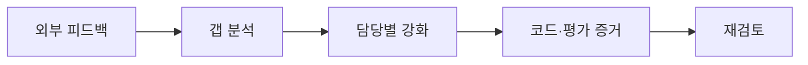

# `docs/feedback/` — 외부 피드백 보관 및 대응 추적

강사님 검토 리포트 등 **외부에서 받은 피드백 원문**과, 그에 대한 **팀의 갭 분석·대응 계획**을 보관하는 폴더입니다.

## 폴더 소개

- **What:** 외부 평가 원문과 내부 대응 계획을 분리 보관합니다.
- **Why:** 낮은 점수나 지적 사항을 덮어쓰지 않고 개선 과정을 근거와 함께 추적합니다.
- 원문은 불변 자료로 취급합니다.
- 대응 문서는 코드·테스트·명령 결과를 증거로 사용합니다.
- 로드맵과 평가 리포트의 수치를 교차 확인합니다.

## 문서 흐름과 결과

검토 점수는 2026-05-31 **20/70**, 2026-06-13 **32/70**, 2026-06-20 **48/70(C)**로 개선됐습니다. 이후 구현 성과는 `eval/reports/`와 현재 코드를 함께 확인합니다.

## 작성 규칙

1. **원문은 수정 없이 보관** — 피드백 원문 파일은 받은 그대로 저장하고 내용을 고치지 않습니다.
2. **파일명 규칙** — `YYYY-MM-DD_<출처>_<식별자>.md` (예: `2026-05-31_강사검토리포트_d24b475.md`)
3. **대응 문서는 별도 파일** — 갭 분석·강화 계획은 원문과 분리해 `YYYY-MM-DD_갭분석_*.md`로 작성하고 버전을 표기합니다.
4. **증거 기반(Evidence-grounded)** — 대응 문서의 모든 "현재 상태" 주장은 `file:line` 또는 명령 실행 결과를 근거로 답니다. (강사님 리포트의 채점 방식과 동일)
5. **진행도 추적 연동** — 루브릭 점수 추적은 `docs/roadmap/<날짜>/progress_dashboard.html`과 정합을 유지합니다.

## 문서 인덱스

| 날짜 | 문서 | 내용 |
|------|------|------|
| 2026-05-31 | [`2026-05-31_강사검토리포트_d24b475.md`](2026-05-31_강사검토리포트_d24b475.md) | 강사님 Full(정적+동적) 검토 리포트 원문 — 20/70 (F), 루브릭 10항목 채점 |
| 2026-06-13 | [`2026-06-13_강사재검토리포트_93487d3.md`](2026-06-13_강사재검토리포트_93487d3.md) | 강사님 Full 재검토 리포트 원문 — 32/70 (D), RAGAS 게이트 해소 및 Docker 동적 검증 |
| 2026-06-13 | [`2026-06-13_갭분석_파트별_강화계획_v1.0.md`](2026-06-13_갭분석_파트별_강화계획_v1.0.md) | 피드백 ↔ 현재 작업 상황 갭 분석 + 파트별(담당자별) 강화·구현 계획 |
| 2026-06-20 | [`2026-06-20_강사재검토리포트_92237ba.md`](2026-06-20_강사재검토리포트_92237ba.md) | 강사님 Full 재검토 리포트 원문 — 48/70 (C), LangGraph·sLLM·MCP·Hybrid RAG 실동작 확인 |
