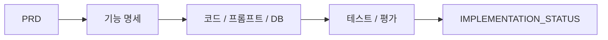

# `docs/functional-spec/` 기능 명세서 관리 규칙

이 폴더는 PRD 기준 기능별 상세 명세서를 관리한다. 기능 명세서는 한 파일에 여러 기능을 섞지 않고, **기능 1개 = Markdown 명세서 1개**를 원칙으로 한다.

## 폴더 소개

- **What:** 기본(B), 고급(A), 시연(D) 기능의 트리거·입력·처리·출력·예외를 정의합니다.
- **Why:** UI, Agent, 데이터, 평가 담당자가 같은 기능 계약을 구현하게 합니다.
- Markdown이 명세 원본이고 HTML dashboard는 탐색·발표용입니다.
- `IMPLEMENTATION_STATUS.md`가 명세와 실제 코드의 대응 상태를 관리합니다.
- 하위 폴더 README가 기능군별 시작점을 제공합니다.

## 동작 원리



기술 형식은 Markdown, Mermaid, HTML이며 검증은 코드 링크·pytest·평가 리포트로 수행합니다.

## 폴더 구조

```text
docs/functional-spec/
├── README.md
├── overview/
│   └── functional_spec_all_features_v0.1.md
├── basic/
│   ├── B1_signup_login_spec_v0.3.md
│   ├── B2_holdings_manage_spec_v0.4.md
│   ├── B3_stock_search_spec_v0.5.md
│   ├── B4_stock_basic_info_spec_v0.6.md
│   └── B5_portfolio_bulk_advice_spec_v0.2.md
├── demo/
│   └── D1_backtesting_validation_spec_v0.1.md
└── advanced/
    ├── A1_valuation_5y_spec_v0.7.md
    ├── A2_industry_qualitative_spec_v0.8.md
    ├── A3_peer_comparison_spec_v1.0.md
    ├── A4_action_recommendation_spec_v1.0.md
    └── A5_stock_recommendation_spec_v1.1.md
```

## 작성 규칙

| 규칙 | 설명 |
|------|------|
| 기능별 분리 | `B1`, `B2`, `A1`처럼 기능 ID별로 별도 파일 작성 |
| 파일명 명확화 | `B1_signup_login_spec_v0.3.md`처럼 기능 ID와 기능명을 함께 표기 |
| 7대 표준 양식 | 트리거, 전제조건, 입력, 처리 흐름, 출력, 예외 처리, 담당 순서 유지 |
| 비용 상한 | 모든 기능에 월 LLM 비용 5만원 상한 및 호출 절감 정책 포함 |
| 예외 처리 | 데이터 결손, API 실패, LLM 실패, 비용 임계점, 사용자 입력 오류를 표로 정리 |
| 코드/프롬프트 분리 | 요구사항과 프롬프트는 코드에 섞지 않고 문서 또는 프롬프트 폴더에 격리 |
| HTML 대시보드 분리 | 명세 본문은 Markdown으로, 발표/현황 대시보드는 별도 HTML로 관리 |

## 멀티 에이전트 공통 기준

기능 명세를 작성하거나 수정할 때는 `docs/architecture/multi_agent_architecture.md`의 agent 책임 경계를 따른다.

| 기능 영역 | 주 담당 Agent | 명세에 반드시 적을 것 |
|-----------|---------------|-----------------------|
| 종목 검색/후보 추천 | Curator | 종목 확정 기준, 후보 반환 조건, 미확정 처리 |
| 5개년 밸류에이션 | Quant | 사용 재무 항목, 계산식, 기준일, 결측 처리 |
| 산업·정성 분석 | Qual | RAG source, 검색 범위, 출처 부착 방식 |
| 동종업계 비교 | Competitor | Peer 선정 기준, 제외 조건, 비교 지표 |
| BUY/HOLD/SELL 분석 신호 | Strategist | signal과 suitability 분리, confidence 산정 기준 |
| 최종 출력/리포트 | Guardrail + Strategist | 금지 표현, disclaimer, Tier 1/2/3 정합성 |

모든 고급 기능 명세에는 다음 항목을 포함한다.

- `as_of_date`: 분석 기준일
- `data_version`: 사용 데이터 버전 또는 적재 기준
- `sources`: 출처 부착 방식
- `warnings`: 데이터 부족, 근거 부족, mock 여부
- `guardrail`: 금지 표현과 완화 표현
- `evaluation`: schema 통과, 출처 부착률, consistency 등 검증 방식

## 파일명 규칙

```text
<기능ID>_<영문기능명>_spec_v<문서버전>.md
```

예시:

```text
B1_signup_login_spec_v0.3.md
B2_holdings_manage_spec_v0.4.md
A1_valuation_5y_spec_v0.7.md
A2_industry_qualitative_spec_v0.8.md
A3_peer_comparison_spec_v1.0.md
A4_action_recommendation_spec_v1.0.md
A5_stock_recommendation_spec_v1.1.md
D1_backtesting_validation_spec_v0.1.md
```

## 기능 목록

| 구분 | 기능 ID | 기능명 | 파일 |
|------|---------|--------|------|
| 기본 | B1 | 회원가입/로그인 | `basic/B1_signup_login_spec_v0.3.md` |
| 기본 | B2 | 보유 종목 등록/조회 | `basic/B2_holdings_manage_spec_v0.4.md` |
| 기본 | B3 | 종목 검색 | `basic/B3_stock_search_spec_v0.5.md` |
| 기본 | B4 | 종목 기본 정보 조회 | `basic/B4_stock_basic_info_spec_v0.6.md` |
| 기본 | B5 | 포트폴리오 일괄 안내 | `basic/B5_portfolio_bulk_advice_spec_v0.2.md` |
| 고급 | A1 | 5개년 밸류에이션 | `advanced/A1_valuation_5y_spec_v0.7.md` |
| 고급 | A2 | 산업·정성 분석 | `advanced/A2_industry_qualitative_spec_v0.8.md` |
| 고급 | A3 | 동종업계 횡비교 | `advanced/A3_peer_comparison_spec_v1.0.md` |
| 고급 | A4 | BUY/HOLD/SELL 분석 신호 | `advanced/A4_action_recommendation_spec_v1.0.md` |
| 고급 | A5 | 종목 추천 | `advanced/A5_stock_recommendation_spec_v1.1.md` |
| 고급 | A6 | PB 리포트 다운로드 | 예정 |
| 데모 | D1 | 백테스팅 예측 검증 데모 | `demo/D1_backtesting_validation_spec_v0.1.md` |

## 참고

- `overview/functional_spec_all_features_v0.1.md`는 초기 통합 초안이다.
- 신규/보완 명세서는 통합 파일을 수정하지 않고 `basic/` 또는 `advanced/` 하위 기능별 파일로 작성한다.
- 기능 확정 후 필요하면 대응되는 HTML 대시보드 프레젠테이션을 별도 파일로 생성한다.
