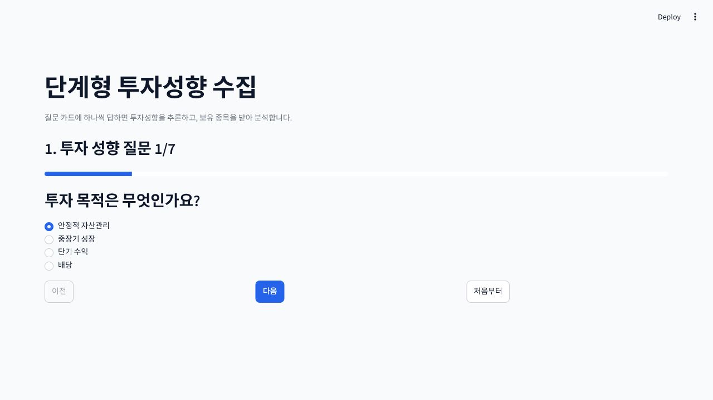
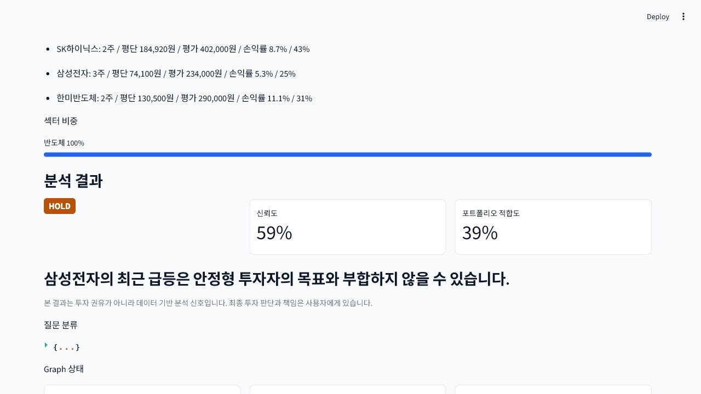

# Streamlit UI 개선 제안

> 검토 기준: 2026-06-20, `http://localhost:8501`, 데스크톱 1280x720<br>
> 범위: Streamlit 유지, 사용자 흐름 개선안만 제시, 이번 문서 작업에서는 UI 코드 미변경

## 현재 화면

| 온보딩 | 분석 결과 |
|--------|-----------|
|  |  |

## 한눈에 보는 진단

현재 UI는 7단계 입력부터 9개 Agent 진행 상태, Tier 1/2/3 결과와 다운로드까지 실제로 동작합니다. 핵심 문제는 기능 부족보다 **첫 화면의 제품 가치가 약하고, 넓은 화면에서 컨트롤이 흩어지며, 분석 결과가 포트폴리오 요약 아래로 밀리는 정보 위계**입니다.

## P0 - 먼저 고칠 항목

### 1. 제품 가치와 전체 단계를 첫 viewport에 표시

현재 제목 `단계형 투자성향 수집`은 내부 기능명에 가깝습니다. 사용자는 무엇을 얻는지 먼저 알아야 합니다.

권장 구조:

```text
내 포트폴리오 AI 분석
투자성향과 보유 종목을 바탕으로 재무·뉴스·Peer·거시 근거를 함께 확인합니다.

[1 투자성향] --- [2 포트폴리오] --- [3 분석 결과]
```

Streamlit 구현은 `st.title`, `st.caption`, `st.progress`만으로 충분합니다. 내부 Agent 이름은 분석 실행 단계에서 공개합니다.

### 2. 온보딩 읽기 폭을 880~960px로 제한

현재 `layout="wide"`와 `max-width: 1500px` 때문에 질문과 버튼 사이가 지나치게 넓습니다. 온보딩·포트폴리오는 좁은 컨테이너가 읽기 쉽고, Agent 결과에서만 넓은 레이아웃이 필요합니다.

권장 방식:

```css
section.main > div.block-container {
  max-width: 960px;
}
```

분석 결과 단계에서만 별도 CSS class 또는 렌더링 구조로 1200px까지 넓힙니다. `data-testid` selector는 Streamlit 버전에 따라 바뀔 수 있어 최소한으로 사용합니다.

### 3. 기본 라디오 선택을 없애고 의도적 응답을 받기

현재 첫 선택지가 이미 체크되어 있어 사용자가 읽지 않고 `다음`을 누를 수 있습니다.

```python
selected_label = st.radio(
    "답변을 선택해 주세요",
    options=labels,
    index=None,
    key=f"onboarding_card_{card['id']}",
)
st.button("다음", type="primary", disabled=selected_label is None)
```

기존 답변이 있는 이전 단계에서는 저장된 index를 복원합니다.

### 4. 행동 버튼을 한 덩어리로 정렬

현재 `이전`, `다음`, `처음부터`가 화면 전체 너비에 분산됩니다. `다음`이 주 행동, `이전`이 보조 행동, `처음부터`는 파괴적 초기화입니다.

권장 배치:

```text
[이전]                                      [다음]
                         처음부터 다시 시작
```

`st.columns([1, 3, 1])`로 이전·다음을 양끝에 놓고 초기화는 작은 secondary 버튼이나 expander 내부로 이동합니다.

## P1 - 결과 이해도 개선

### 5. 저장된 포트폴리오는 결과 단계에서 접기

분석 완료 후에도 긴 보유 종목 목록이 먼저 보여 결과가 아래로 밀립니다. 결과 단계에서는 핵심만 한 줄로 남깁니다.

```text
포트폴리오 3종목 · 평가금액 926,000원 · 현금 0%  [상세 보기]
```

상세 보유 내역은 `st.expander("입력 포트폴리오", expanded=False)`로 이동합니다.

### 6. Tier 1을 결과 화면의 가장 강한 카드로 만들기

현재 HOLD badge는 작고 신뢰도·적합도 metric이 더 크게 보입니다. 판단, 신뢰도, 적합도, 한 줄 근거를 하나의 primary container에 묶는 편이 낫습니다.

```text
HOLD  보유 유지
신뢰도 59% · 내 포트폴리오 적합도 39%
삼성전자의 최근 급등은 안정형 투자자의 목표와 부합하지 않을 수 있습니다.
```

색상만으로 신호를 구분하지 않고 `보유 유지`, `비중 검토` 같은 한국어 상태를 함께 표시합니다.

### 7. 개발자 메타데이터는 고급 정보로 이동

질문 분류 JSON, graph route, 모델명은 디버깅에는 유용하지만 일반 사용자에게 먼저 필요하지 않습니다. `st.expander("분석 실행 정보")` 안에 route, contributing agents, model, fallback 상태를 모읍니다.

### 8. 근거 탭을 사용자의 질문 순서로 정리

현재 6개 탭은 기능적으로 좋습니다. 다음 순서가 사용자 판단 흐름에 더 가깝습니다.

1. 핵심 근거
2. 리스크
3. 내 포트폴리오
4. 재무
5. 뉴스·공시
6. Peer·거시

모바일에서는 탭이 좁아지므로 관련 근거를 3~4개 그룹으로 합치거나 `st.expander`를 사용합니다.

## P2 - 신뢰와 완성도

### 9. Agent 진행 상태에 역할과 결과를 함께 표시

현재 완료 여부와 score가 보이는 점은 좋습니다. `Quant - 재무·가격`, `Qual - 뉴스·공시`처럼 역할을 한 줄 추가하고, 완료 후에는 근거 개수나 fallback 여부를 표시하면 사용자가 기다리는 이유를 이해하기 쉽습니다.

### 10. 애니메이션 접근성 추가

Robot 애니메이션은 진행 중임을 보여주지만 motion에 민감한 사용자를 위해 다음 규칙을 추가합니다.

```css
@media (prefers-reduced-motion: reduce) {
  .robot-worker, .robot-eye, .robot-panel,
  .robot-arm-left, .robot-arm-right, .robot-shadow {
    animation: none !important;
  }
}
```

### 11. 실패·근거 부족 상태를 정상 결과와 시각적으로 분리

RAG 결과가 비거나 fallback이 사용된 경우 단순 본문 bullet보다 `st.warning` 또는 amber 카드로 표시합니다. 신뢰도 감점 이유와 재실행 조건을 함께 알려야 합니다.

## Streamlit 제약과 대응

| 제약 | 대응 |
|------|------|
| widget 변경마다 전체 rerun | 모든 단계 값을 `st.session_state`에 명시적으로 보존 |
| DOM selector가 버전별로 바뀜 | 기본 컴포넌트와 자체 class 우선, `data-testid` 사용 최소화 |
| 반응형 breakpoint 제어 제한 | CSS grid `auto-fit/minmax`, 모바일에서 1열 전환 |
| 브라우저 history 제어 제한 | 단계 전환을 session state와 명시적 이전 버튼으로 제공 |
| custom HTML 접근성 위험 | 입력은 `st.radio`, `st.button`, `st.expander` 등 기본 위젯 유지 |

## 권장 적용 순서

1. 제목·3단계 진행 표시·온보딩 최대 폭
2. 라디오 `index=None`와 CTA 정렬
3. 결과 단계 포트폴리오 접기와 Tier 1 카드 강화
4. 개발자 정보 expander와 근거 그룹 재정렬
5. 모바일·키보드·reduced-motion 검증

## 검증 체크리스트

- 1280x720 첫 화면에서 제목, 설명, 현재 단계, 질문, 주요 CTA가 모두 보이는가?
- 답을 선택하지 않으면 다음 단계로 갈 수 없는가?
- 분석 완료 후 첫 화면에서 signal, 신뢰도, 적합도, 한 줄 근거가 보이는가?
- 390px 폭에서 버튼·탭·카드가 잘리거나 가로 스크롤을 만들지 않는가?
- 색상 없이도 상태를 이해할 수 있고 키보드 focus가 보이는가?
- 콘솔 오류와 Streamlit 예외 overlay가 없는가?
