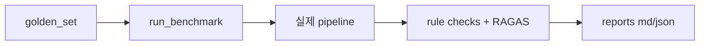

# `eval/` — 평가 하네스 (Evaluation Harness)

부트캠프 W2 학습 적용 영역. 시스템 신뢰성을 **정량 지표**로 측정합니다.

## 폴더 소개

- **What:** 사용자 페르소나와 결정적 비교 시나리오를 실제 파이프라인에 흘려 회귀를 측정합니다.
- **Why:** 화면이 열리는지만 확인하지 않고 분류·신호·근거·안전 계약을 수치로 관리합니다.
- 규칙 기반 평가는 API 비용 없이 모든 실행에서 사용할 수 있습니다.
- RAGAS는 worker 근거와 답변의 충실도를 LLM judge로 측정합니다.
- 보고서는 Markdown과 JSON으로 함께 남겨 사람과 자동화가 모두 읽습니다.

## 기술 스택과 동작 원리

pytest, JSON 골든셋, RAGAS, OpenRouter judge, sentence-transformers를 사용합니다.



## 최신 성과

| 평가 | 결과 |
|------|------|
| Phase 1 rule-based | **40/41** |
| RAGAS faithfulness | **0.4096** (목표 0.80 미달) |
| Competitor 회귀 | **6/6** |

## 파일 (실제 구현 상태)

```
eval/
├── golden_set/
│   ├── personas.json              ✅ 페르소나 5개 케이스 (질문 + 투자성향 + 포트폴리오)
│   └── expected_outputs.json      ✅ 케이스별 기대 결과 (intent·urgency·종목·공통 계약)
├── competitor_golden/
│   └── cases.json                 ✅ Competitor peer 비교 품질 회귀 스냅샷 6케이스 (DB·LLM 미사용)
├── reports/
│   ├── YYYY-MM-DD_benchmark.md         ✅ 파이프라인 평가 (md + json 쌍)
│   └── YYYY-MM-DD_competitor_eval.md   ✅ Competitor 회귀 평가 (md + json 쌍)
├── run_benchmark.py               ✅ 파이프라인 전체 평가 (rule-based + RAGAS)
└── run_competitor_eval.py         ✅ Competitor peer 비교 품질 회귀 (순수 엔진, 비용 0원)
```

## 측정 지표

| 지표 | 측정 방법 | LLM 비용 | 목표 |
|------|----------|---------|------|
| Rule-based 계약 준수 | 신호 유효성·면책 문구·confidence/suitability 범위·근거 존재·intent/urgency 분류 일치 | 0원 | 100% |
| RAGAS Faithfulness | LLM-as-judge (OpenRouter) — 답변이 worker 근거(contexts)에 충실한지 | 소액 | ≥ 0.80 |
| RAGAS Answer Relevancy | judge + 로컬 bge-m3 임베딩 (`--with-relevancy`) | 소액 | ≥ 0.70 |

## 실행

```bash
pip install -e .[eval]                        # 최초 1회

python eval/run_benchmark.py                  # 전체 5케이스 + faithfulness
python eval/run_benchmark.py --skip-ragas     # LLM 비용 0원 (rule-based만)
python eval/run_benchmark.py --limit 2        # 케이스 수 제한 (크레딧 절약)
python eval/run_benchmark.py --case park_minho_hold_review
python eval/run_benchmark.py --with-relevancy # answer_relevancy 추가
```

## 비용 정책 (중요)

- RAGAS judge는 `OPENROUTER_API_KEY` 가 설정된 경우에만 호출됩니다. 키가 없으면 rule-based만 수행하고 정상 종료합니다.
- judge 모델은 `OPENROUTER_MODEL` 설정을 따릅니다 (기본: 저비용 flash 계열).
- 임베딩은 비용이 들지 않는 로컬 bge-m3 (Qual RAG와 동일 모델)를 사용합니다.
- **팀 OpenRouter 크레딧이 한정되어 있으니 전체 케이스 + relevancy 실행은 하루 1회 이내를 권장합니다.**

## Competitor peer 비교 품질 회귀 (`run_competitor_eval.py`)

peer 선정·상대위치 점수 엔진(`peer_tool.select_peer_rows`·`calculate_relative_position`)은
DB·LLM 없이 입력만으로 결정되는 순수 함수입니다. 고정된 비교 시나리오를 흘려 출력
(선정 peer 순서·종합 score·핵심 플래그)이 베이스라인 스냅샷과 일치하는지 검사합니다.

```bash
python eval/run_competitor_eval.py            # 비교 모드 (불일치 시 exit 1)
python eval/run_competitor_eval.py --update    # 의도된 로직 변경 후 스냅샷 재기록(베이스라인)
```

| 케이스 | 검증 의도 |
|--------|-----------|
| C1 정상 비교 | 가까운 peer 3개 정상 선정, 경고 없음 |
| C2 시총 band 거름 | 4배 초과 대형 peer 제외 + peer 부족 경고 |
| C3 이상치 표기 | 중앙값 10배 초과 PER에 `outlier_per` 플래그 |
| C4 비교군 없음 | score 0, `no_comparable_peers` |
| C5 저품질 타깃 캡 | 데이터 완성도 60 미만 → score ≤ 55 |
| C6 복합 유사도(#62) | 시총·사업경제성 동일 peer가 완성도만 높은 peer보다 우선 |

CI는 `tests/test_competitor_eval.py`로 이 스위트를 매번 실행합니다(비용 0원).
로직을 의도적으로 바꾼 경우에만 `--update`로 스냅샷을 갱신하고 변경을 리뷰하세요.

## 골든셋 확장 규칙

- `personas.json` 의 `cases[]` 에 케이스를 추가하고, 같은 `case_id` 로 `expected_outputs.json` 에 기대값을 추가합니다.
- 기대값에 넣을 수 있는 키: `expected_stock_code`, `expected_intent`, `expected_urgency`, `expect_candidates`
- 케이스는 실제 사용자 시나리오(보유 점검·추가 매수·손절·공시 확인·포트폴리오 리뷰)를 대표해야 합니다.
