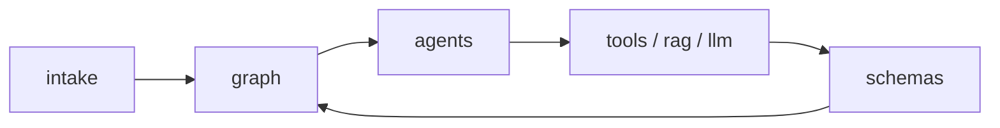

# `src/stock_agent/` - 멀티에이전트 애플리케이션 코어

> 사용자 입력부터 전문 분석, 합성, Guardrail, 렌더링까지의 도메인 로직을 제공하는 Python 패키지입니다.

## 폴더 소개

- **What:** Agent, LangGraph, 데이터 Tool, RAG, LLM, 스키마를 하나의 패키지로 묶습니다.
- **Why:** Streamlit은 표현과 세션 상태에 집중하고 분석 로직은 독립적으로 테스트합니다.
- `intake.py`가 7단계 질문과 포트폴리오 입력을 구조화합니다.
- `graph/`가 Agent를 동적 병렬 실행하고 장애를 격리합니다.
- `schemas/`의 Pydantic 모델이 모듈 사이 입출력 계약을 고정합니다.

## 기술 스택

| 영역 | 기술 |
|------|------|
| 계약 | Pydantic 2 |
| 그래프 | LangGraph `StateGraph`, `Send` |
| 저장 | psycopg, PostgreSQL, pgvector |
| LLM | OpenRouter, GLM, 규칙 기반 fallback |
| 관측 | LangSmith 환경 설정, `observability.py` |

## 동작 원리



실제 전체 흐름은 [README 아키텍처](../../docs/architecture/readme_system_architecture.md)를 참고합니다.

## 검증

```bash
python -m pytest tests/test_phase1_pipeline.py tests/test_streamlit_intake.py
```

## 디렉토리 구조

| 경로 | 책임 |
|------|------|
| `agents/` | 분류·분석·합성·검증 실행 단위 |
| `graph/` | 동적 fan-out과 join |
| `tools/` | DB 조회와 계산 |
| `rag/` | 임베딩·Hybrid Search |
| `llm/` | 외부 모델 클라이언트와 fallback |
| `mcp_bridge/` | Competitor peer 데이터 MCP |
| `schemas/` | Pydantic 입출력 계약 |
| `prompts/` | Agent별 시스템 프롬프트 |
| `harness/` | 횡단 정책 확장 지점 |
