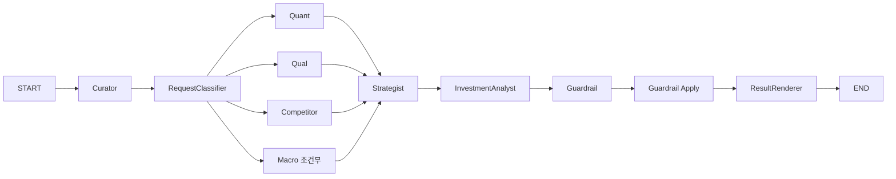

# `src/stock_agent/graph/` - LangGraph 오케스트레이션

> `StateGraph`와 `Send`로 Agent를 동적 병렬 실행하고 부분 실패를 최종 결과까지 안전하게 전달합니다.

## 폴더 소개

- **What:** 분석 상태, 노드 wrapper, fan-out, join, 이벤트 스트리밍을 `pipeline.py`에서 관리합니다.
- **Why:** Agent가 서로를 직접 호출하지 않고 명시적 그래프와 공통 상태를 통해 협업하게 합니다.
- Curator와 RequestClassifier가 요청을 구조화합니다.
- Quant, Qual, Competitor와 조건부 Macro가 `Send`로 병렬 실행됩니다.
- Strategist 이후 InvestmentAnalyst, Guardrail, ResultRenderer가 순차 실행됩니다.

## 기술 스택

LangGraph `StateGraph`, `Send`, Python `TypedDict`, Pydantic `AgentState`를 사용합니다.

## 현재 동작



정확한 데이터 연결은 [README 시스템 아키텍처](../../../docs/architecture/readme_system_architecture.md)를 참고합니다.

## 파일과 인터페이스

| 파일 | 역할 |
|------|------|
| `pipeline.py` | 그래프 정의, 이벤트 스트리밍, Tier 출력 변환 |
| `__init__.py` | 앱에서 사용하는 실행 함수 export |

`stream_phase1_analysis_events()`는 UI 진행 로그를, `run_phase1_analysis()`는 동기 최종 결과를 제공합니다.

## 장애 처리와 검증

- Worker 예외는 `worker_errors`에 누적하고 가능한 결과로 계속 진행합니다.
- Strategist 예외는 낮은 신뢰도의 보수적 HOLD로 격리합니다.
- Guardrail 수정 필요 상태는 제한된 재합성을 거칩니다.

```bash
python -m pytest tests/test_phase1_pipeline.py tests/agents/test_pipeline_guardrail_integration.py
```
