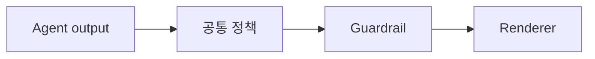

# `src/stock_agent/harness/` - 횡단 정책 확장 지점

> 출처 추적, 용어 풀이, PII 필터처럼 여러 Agent에 공통 적용할 기능을 위한 패키지 경계입니다.

## 현재 상태

- 현재 추적 파일은 `.gitkeep`과 이 README뿐이며 실행 모듈은 아직 없습니다.
- 실제 Guardrail은 `agents/guardrail.py`와 `graph/pipeline.py`에 구현되어 있습니다.
- 실제 책임 고지는 `agents/result_renderer.py`와 Streamlit 출력에서 적용됩니다.
- 향후 공통 기능이 두 개 이상 Agent에서 반복될 때만 이 폴더로 이동합니다.
- 계획 항목을 현재 구현처럼 import하거나 문서화하지 않습니다.

## 예정 기술 스택

Python decorator/middleware, Pydantic 결과 모델, 정규식과 결정적 규칙을 우선 사용합니다.

## 동작 원리



## 추가 기준

1. 공통 인터페이스와 실패 정책을 먼저 정의합니다.
2. 네트워크나 DB 접근을 횡단 helper에 숨기지 않습니다.
3. 관련 Agent·통합 테스트를 함께 추가합니다.

## 디렉토리 구조

```text
harness/
|- .gitkeep
`- README.md
```
