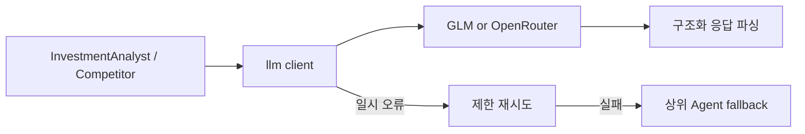

# `src/stock_agent/llm/` - LLM 클라이언트와 폴백 경계

> 외부 모델 호출, 재시도, 응답 파싱을 Agent 도메인 로직과 분리합니다.

## 폴더 소개

- **What:** GLM과 OpenRouter의 chat completion 호출 adapter를 제공합니다.
- **Why:** API 키, timeout, 재시도, 응답 형태를 Agent마다 중복 구현하지 않게 합니다.
- `glm_client.py`는 OpenAI-compatible GLM 호출을 담당합니다.
- `openrouter_client.py`는 Qwen 계열 모델 호출과 일시 오류 재시도를 담당합니다.
- 외부 호출 실패 시 상위 Agent가 규칙 기반 결과로 fallback합니다.

## 기술 스택

Python `requests`, OpenAI-compatible HTTP API, JSON parsing을 사용합니다.

## 동작 원리



## 파일

| 파일 | 역할 |
|------|------|
| `glm_client.py` | GLM chat/completions adapter |
| `openrouter_client.py` | OpenRouter 호출, 응답 정규화, 재시도 |

## 설정과 비용 정책

키를 저장소에 커밋하지 않고 실행 프로세스 환경변수로 주입합니다. 월 비용 원칙은 [`docs/operations/llm_cost_guide.md`](../../../docs/operations/llm_cost_guide.md)를 따릅니다.

```bash
GLM_API_KEY=... scripts/run_local_streamlit.sh
python -m pytest tests/llm -v
```
