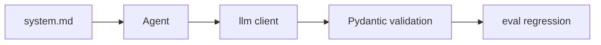

# `src/stock_agent/prompts/` - Agent 시스템 프롬프트

> LLM 지시문을 Python 코드에서 분리해 리뷰·평가·변경 추적이 가능하게 합니다.

## 폴더 소개

- **What:** LLM을 사용하는 Agent별 `system.md`를 보관합니다.
- **Why:** PM과 개발자가 코드 변경 없이 표현·제약·출력 조건을 검토할 수 있게 합니다.
- 현재 Curator, RequestClassifier, Quant, Qual, Competitor, InvestmentAnalyst 프롬프트가 있습니다.
- Strategist와 Guardrail은 현재 결정적 Python 로직을 중심으로 동작합니다.
- 프롬프트 변경은 관련 단위 테스트와 `eval/run_benchmark.py`로 회귀 확인합니다.

## 기술과 동작 원리

Markdown 프롬프트를 UTF-8로 읽어 LLM 클라이언트에 전달하고, 응답은 [`schemas/analysis.py`](../schemas/analysis.py)의 모델과 Agent parser가 검증합니다.



## 현재 구조

```text
prompts/
|- curator/system.md
|- request_classifier/system.md
|- quant/system.md
|- qual/system.md
|- competitor/system.md
`- investment_analyst/system.md
```

## 작성 규칙

1. 출처 없는 숫자·사실 생성을 금지합니다.
2. Tool 계산과 LLM 해석을 구분합니다.
3. BUY/HOLD/SELL은 권유가 아닌 분석 신호로 표현합니다.
4. 출력 키와 값 범위를 parser·schema와 맞춥니다.
5. 하위 README에 Agent별 핵심 계약을 기록합니다.
