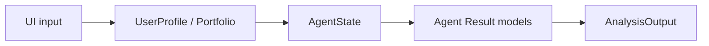

# `src/stock_agent/schemas/` — Pydantic 모델

## 핵심 원칙

> **에이전트 사이를 오가는 모든 데이터는 Pydantic 스키마에 정의된 형식만 허용.**

이유: LLM이 자유 JSON을 만들면 누락/오타가 발생. 스키마 강제로 시스템 안정성 확보.

## 기술 스택과 동작 원리

Pydantic 2의 type validation, enum/literal, nested model, `model_copy`를 사용합니다.



모델 변경은 생산자와 소비자를 동시에 수정하고 `python -m pytest tests/test_competitor_schema.py tests/test_phase1_pipeline.py`로 검증합니다.

## 현재 파일

| 파일 | 모델 | 사용처 |
|------|------|--------|
| `analysis.py` | `UserProfile`, `Portfolio`, `Holding`, `AgentState`, agent별 Result, `AnalysisOutput` | Phase 1 agent 입출력 |
| `__init__.py` | 주요 schema export | app/graph import |

## 확장 권장 필드

금융 분석 결과는 재현 가능성과 감사 가능성이 중요하므로 다음 필드를 schema에 추가하는 방향을 검토합니다.

| 필드 | 대상 | 이유 |
|------|------|------|
| `request_id` | `AgentState`, 모든 log | 분석 실행 추적 |
| `as_of_date` | `AgentState`, Result | 기준일과 백테스트 |
| `data_version` | `AgentState`, Result | 데이터 스냅샷 재현 |
| `sources` | `QuantResult`, `QualResult`, `CompetitorResult`, `StrategistResult` | 출처 부착률 평가 |
| `warnings` | 모든 Result | 데이터 부족/근거 부족 표시 |
| `cost_trace` | `AgentState` | 월 5만원 비용 상한 관리 |
| `evidence_bundle` | `AgentState` | Guardrail과 RAG 평가 |

## 네이밍 원칙

- BUY/HOLD/SELL은 `recommendation`보다 `signal`이라는 이름을 우선 사용합니다.
- 금융 문맥에서 “권유”로 오해될 수 있는 필드명은 피합니다.
- 정량 계산 결과와 LLM 해석 결과를 구분합니다.

## 디렉토리 구조

```text
schemas/
|- analysis.py  # 전체 분석 입출력과 상태
`- __init__.py  # 공개 모델 export
```
