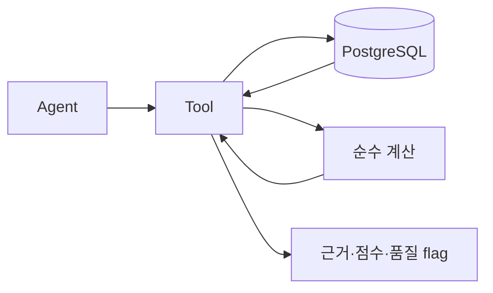

# `src/stock_agent/tools/` — 데이터 조회와 계산 Tool

이 폴더는 agent가 사용하는 DB 조회, 외부 API 호출, 계산 함수를 담습니다. `agents/`에는 판단 흐름을 두고, `tools/`에는 데이터 접근과 계산을 둡니다.

## 기술 스택과 동작 원리

PostgreSQL, psycopg/psycopg2와 결정적 Python 계산을 사용합니다.

금융 수치와 peer 순위는 Tool에서 계산하고 LLM은 결과를 해석만 합니다.

## 파일 구조

| 파일 | 상태 | 기능 | 사용 Agent |
|------|------|------|------------|
| `peer_tool.py` | ✅ 구현 | 동종업계 peer 선정(섹터 + 시총 밴드 0.25x~4x 1차 거름 → **시총·영업이익률(사업 경제성)·데이터 완성도 가중 복합 유사도** `peer_similarity` 정렬), PER/PBR/ROE/성장률/마진/부채비율 비교, 상대 위치 percentile과 0~100 종합 점수, outlier 플래깅, 데이터 품질 플래그 | Competitor |
| `financial_tool.py` | ✅ 구현 | 기준일 이전 최신 재무제표 조회, 계정명 중복 방어, 단위 오류 보정 | Quant |
| `price_tool.py` | ✅ 구현 | 기준일 이전 최신 시세·KRX 지표(close/volume/market_cap/PER/PBR) 조회 | Quant |
| `rag_tool.py` | ✅ 구현 | 기간 내 공시 보고서 원문 조회 (disclosure_report + content JOIN) | Qual |
| `macro_tool.py` | ✅ 구현 | 업종별 매크로 지표 매핑과 context 생성 | Quant, Strategist |
| `company_tool.py` | 🔜 예정 | 종목 검색, `stock_code`/`corp_code` 조회 | Curator, Competitor |
| `cache_tool.py` | 🔜 예정 | 분석 캐시 조회/저장 | Pipeline, Strategist |

> ⚠️ DB 드라이버 현황: `peer_tool.py`는 `psycopg`(v3), 나머지 구현 파일은 `psycopg2`를 사용합니다.
> 두 드라이버 모두 `pyproject.toml`에 선언되어 있으며, 추후 psycopg(v3)로 통일이 필요합니다.

## 작업 규칙

- Tool은 가능한 **순수 함수** 로 작성합니다. 사이드 이펙트는 캐싱과 로깅으로 제한합니다.
- 외부 API 호출은 **반드시 캐시 우선** 으로 설계합니다.
- API 키는 `.env` 에서만 로드. 코드 하드코딩 금지.
- Tool 호출 결과는 향후 LangSmith와 Postgres 분석 로그에 기록합니다.
- Tool output은 agent가 바로 사용할 수 있도록 Pydantic schema 또는 명확한 dict 구조로 반환합니다.
- 금융 계산은 LLM이 아니라 Tool에서 처리합니다.

## 현재 상태

- `peer_tool.py`는 Competitor Agent의 실제 경로로 연결되어 있고, **DB 연결 실패 시 폴백 우선순위는 ① MCP 실시간 시세(실데이터) → ② 하드코딩 mock(최후 보루)** 입니다 (`agents/competitor.py`).
  - ①은 `src/stock_agent/mcp_bridge/`의 자체 FastMCP 서버를 **stdio 자식 프로세스**로 띄워(`initialize → tools/list → call_tool` 핸드셰이크) pykrx 시세 기반 peer 비교를 만듭니다(루브릭 #6 "실동작 1경로"). 상세는 [`mcp_bridge/README.md`](../mcp_bridge/README.md) 참고.
  - `peer_tool.build_comparison_from_market_rows`가 DB 없이 외부 시세 레코드로 동일한 점수·상대위치 엔진을 재사용합니다(기존 DB 로더 함수 시그니처는 무변경 — monkeypatch 계약 유지).
- `peer_tool.py`의 순수 계산 함수(`calculate_metric_row`, `calculate_relative_position`, `select_peer_rows` 등)는 DB 없이 단위 테스트 가능하며, `tests/tools/test_peer_tool.py`에서 검증합니다.
- peer 비교 **품질 회귀**는 `eval/run_competitor_eval.py`(골든셋 `eval/competitor_golden/cases.json`)로 고정합니다 — peer 선정 순서·종합 score·핵심 플래그를 결정적 스냅샷과 대조하며, CI(`tests/test_competitor_eval.py`)에서 비용 0원으로 매번 실행됩니다.
- Competitor의 LLM narrative는 `llm/openrouter_client.py`를 통해 호출하며, 일시적 장애(429·5xx·네트워크 오류)에 한해 최대 2회 재시도합니다. 수치는 LLM이 만들지 않고 Tool 계산 결과를 해석만 합니다.

## 주요 결과와 검증

- Competitor 순수 계산 회귀: **6/6** (`python eval/run_competitor_eval.py`)
- Tool 단위 테스트: `python -m pytest tests/tools -v`
- 스키마·DB 변경 시 `python scripts/check_db.py`로 실제 테이블을 확인합니다.
