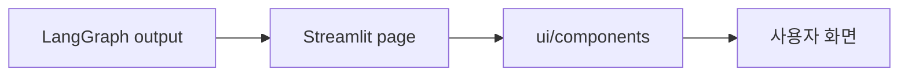

# `ui/` - Streamlit 재사용 표현 계층

> Streamlit 페이지에서 공통으로 사용할 카드·상태·책임고지 표현의 책임 영역입니다.

## 폴더 소개

- **What:** 페이지에서 import하는 작은 렌더링 컴포넌트를 보관합니다.
- **Why:** Tier 카드, 진행 상태, 면책 문구의 중복을 줄이고 표현 일관성을 유지합니다.
- 현재 실제 UI는 `streamlit_app.py`에 구현되어 있습니다.
- `components/`는 `.gitkeep`만 있는 분리 예정 영역입니다.
- DB 조회, LLM 호출, Agent 실행은 UI 컴포넌트가 직접 수행하지 않습니다.

## 기술 스택

| 기술 | 용도 |
|------|------|
| Streamlit | 카드, metric, status, tab, download |
| HTML/CSS | 제한적인 Tier 카드 표현 |
| Pydantic | 렌더링 입력 계약 |

## 동작 원리



## 현재 결과와 개선 방향

- 실행 가능한 단일 페이지 UI는 7단계 온보딩, 포트폴리오 입력, 9개 Agent 진행 상태, Tier 1/2/3 결과를 제공합니다.
- 실제 캡처는 [`docs/assets/readme/`](../docs/assets/readme/README.md)에 있습니다.
- 우선순위별 개선안은 [Streamlit UI 개선 제안](../docs/guides/streamlit_ui_improvement_proposal.md)을 참고합니다.

## 디렉토리 구조

```text
ui/
|- README.md
`- components/  # 재사용 컴포넌트 분리 예정
```

## 작업 규칙

- 컴포넌트는 Pydantic 결과를 받아 Streamlit 호출만 수행합니다.
- 비즈니스 로직과 세션 전이는 페이지 또는 `src/stock_agent/`가 담당합니다.
- 컴포넌트 추가 시 렌더링 입력과 fallback 상태를 테스트합니다.
