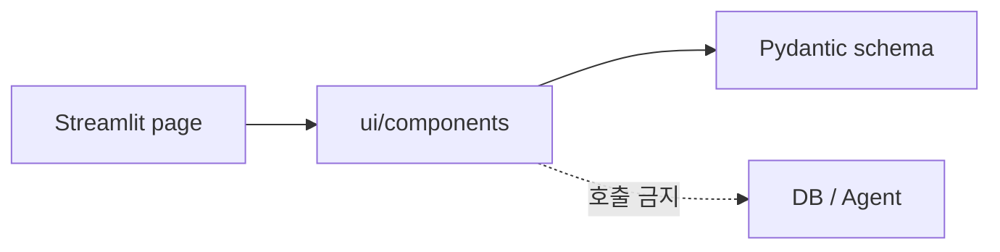

# `ui/components/` - Streamlit 재사용 컴포넌트 자리

> 여러 Streamlit 페이지에서 공유할 카드·상태·책임고지 컴포넌트의 책임 경계입니다.

## 폴더 소개

- **What:** 반복되는 UI 표현을 함수 또는 작은 모듈로 분리합니다.
- **Why:** 페이지마다 CSS와 결과 카드를 복제하지 않게 합니다.
- 현재는 `.gitkeep`만 있으며 실제 컴포넌트는 아직 분리되지 않았습니다.
- `streamlit_app.py`의 동작을 먼저 테스트한 뒤 안정된 조각만 이동합니다.
- 데이터 조회나 Agent 실행 로직은 이 폴더에 두지 않습니다.

## 예정 기술 스택

Streamlit 기본 컴포넌트, 제한된 `st.markdown` CSS, Pydantic 결과 모델을 사용합니다.

## 구조 원칙

## 검증

컴포넌트가 추가되면 렌더링 입력을 순수 함수로 분리하고 `tests/test_result_renderer.py` 또는 별도 Streamlit 테스트를 추가합니다.
